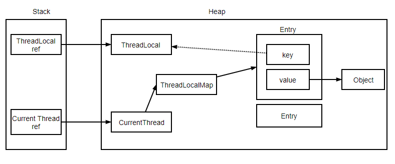

从 JDK1.2 版本开始，Java 把对象的引用分为四种级别，从而使程序能更加灵活的控制对象的生命周期。这四种级别由高到低依次为：强引用、软引用、弱引用和虚引用。为什么要区分这么多引用呢，其实这和 Java 的 GC 有密切关系。

接下来先一起看看四种引用的区别

<!-- more -->

## 强引用

**特点**

- 把一个对象赋给一个引用变量，这个引用变量就是一个强引用。
- 强引用是我们最常见的普通对象引用，只要还有强引用指向一个对象，就能表明对象还活着
- 当内存不足的时候，jvm 开始垃圾回收，对于强引用的对象，就算出现 OOM 也不会回收该对象的。
  因此，强引用是造成 java 内存泄露的主要原因之一。
- 对于一个普通的对象，如果没有其他的引用关系，只要超过了引用的作用域或者显示的将引用赋值为 null，GC 就会回收这个对象了。

强引用就是我们经常使用的引用，其写法如下：

```javascript
Object o = new Object();
```

只要还有强引用指向一个对象，垃圾收集器就不会回收这个对象；显式地设置 o 为 null，或者超出对象的生命周期，此时就可以回收这个对象。具体回收时机还是要看垃圾收集策略。

**示例**

```java
public static void main(String[] args) throws InterruptedException {

        System.out.println("===========Reference==========");
        Object o = new Object();
        System.gc();
        TimeUnit.SECONDS.sleep(1);
        System.out.println(o);
        o = null;
        System.gc();
        TimeUnit.SECONDS.sleep(1);
        System.out.println(o);
    }

// 打印
===========Reference==========
java.lang.Object@1f554b06
null // 没有引用，被GC
```


## 软引用

**特点**

- 软引用是一种相对强化引用弱化了一些引用，需要使用 java.lang.SoftReference 类来实现。
- 对于只有软引用的对象来说，
  当系统内存充足时，不会被回收；
  当系统内存不足时，会被回收；
- 软引用适合用于缓存，当内存不足的时候把它删除掉，使用的时候再加载进来

**示例**

```java
public static void main(String[] args) throws InterruptedException {

        System.out.println("===========SoftReference==========");
        Object object1 = new Object();
        SoftReference<Object> softReference = new SoftReference<>(object1);

        System.out.println(object1);
        System.out.println(softReference.get());

        object1 = null;
        System.gc();
        TimeUnit.SECONDS.sleep(1);

        System.out.println(object1);
        System.out.println(softReference.get());
}

// 打印
===========SoftReference==========
java.lang.Object@694e1548
java.lang.Object@694e1548
null 
java.lang.Object@694e1548 // 内存充足，没有回收
```


**使用场景**

软引用**适合用于缓存**，当内存不足的时候把它删除掉，使用的时候再加载进来。

例如：图片缓存。图片缓存框架中，“内存缓存”中的图片是以这种引用保存，使得  JVM 在发生 OOM 之前，可以回收这部分缓存。此外，还可以用在网页缓存上。

```java
Browser prev = new Browser();               // 获取页面进行浏览
SoftReference sr = new SoftReference(prev); // 浏览完毕后置为软引用        
if(sr.get()!=null) { 
    rev = (Browser) sr.get();           // 还没有被回收器回收，直接获取
} else {
    prev = new Browser();               // 由于内存吃紧，所以对软引用的对象回收了
    sr = new SoftReference(prev);       // 重新构建
}
```


## 弱引用

**特点**

- 弱引用需要用 java.lang.WeakReference 类来实现，它比软引用的生存期更短。
- 如果一个对象只是被弱引用引用者，那么只要发生 GC，不管内存空间是否足够，都会回收该对象。
- 弱引用适合解决某些地方的内存泄漏的问题


**示例**

```java
public static void main(String[] args) throws InterruptedException {

        System.out.println("===========WeakReference==========");
        Object object2 = new Object();
        WeakReference<Object> weakReference = new WeakReference<>(object2);

        System.out.println(object2);
        System.out.println(weakReference.get());

        object2 = null;
        System.gc();
        TimeUnit.SECONDS.sleep(1);

        System.out.println(object2);
        System.out.println(weakReference.get());

        System.out.println("=================HashMap===============");

        HashMap<String, Object> map = new HashMap<>();
        String key = new String("test-key");
        map.put(key, "hello");
        System.out.println(map);
        key = null;
        System.gc();
        System.out.println(map);

        System.out.println("================WeakHashMap================");

        WeakHashMap<String, Object> map2 = new WeakHashMap<>();
        String key2 = new String("test-key");
        map2.put(key2, "hello");
        System.out.println(map2);
        key2 = null;
        System.gc();
        System.out.println(map2);
    }
// 打印
===========WeakReference==========
java.lang.Object@1c3a4799
java.lang.Object@1c3a4799
null
null // 被回收了
=================HashMap===============
{test-key=hello}
{test-key=hello} // key设置为null 数据没清除
================WeakHashMap================
{test-key=hello}
{} // key设置为null 数据清除
```


**使用场景**

- ThreadLocal 静态内部类 ThreadLocalMap 中的 Entiry 中的 key 就是一个虚引用；
- WeakHashMap 的中使用WeakReference

*注意：后面会讨论下 ThreadLocal 和WeakHashMap 关于内存泄露问题*


## 虚引用

**特点**

- 虚引用并不会决定对象的生命周期。如果一个对象仅持有虚引用，那么它就和没有任何引用一样，在任何时候都可能被垃圾回收器回收。

- 虚引用必须和引用队列（ReferenceQueue）联合使用。当垃圾回收器准备回收一个对象时，如果发现它还有虚引用，就会在回收对象的内存之前，把这个虚引用加入到与之关联的引用队列中。而其他几种引用是否使用ReferenceQueue是可选的。
- PhantomReference 的 get 方法总是返回 null, 因此无法访问对应的引用对象。设置虚引用关联的唯一目的, 就是在这个对象被收集器回收的时候收到一个系统通知（这里所谓的收到系统通知其实还是通过开启线程监听该引用队列的变化情况来实现的）或者后续添加进一步的处理

** 示例**

```java
public static void main(String[] args) throws InterruptedException {

        System.out.println("================PhantomReference ================");
        Object object3 = new Object();
        ReferenceQueue queue = new ReferenceQueue();
        PhantomReference<Object> phantomReference = new PhantomReference<>(object3, queue);

        System.out.println(object3);
        System.out.println(phantomReference.get());
        System.out.println(queue.poll());

        object3 = null;
        System.gc();
        TimeUnit.SECONDS.sleep(1);

        System.out.println(object3);
        System.out.println(phantomReference.get());
        System.out.println(queue.poll());
    }
// 打印
================PhantomReference ================
java.lang.Object@711f39f9
null
null
null
null
java.lang.ref.PhantomReference@71bbf57e
```

**使用场景**

可以用来跟踪对象呗垃圾回收的活动。一般可以通过虚引用达到回收一些非java内的一些资源比如堆外内存的行为。例如：在 DirectByteBuffer 中，会创建一个 PhantomReference 的子类Cleaner的虚引用实例用来引用该 DirectByteBuffer 实例，Cleaner 创建时会添加一个 Runnable 实例，当被引用的 DirectByteBuffer 对象不可达被垃圾回收时，将会执行 Cleaner 实例内部的 Runnable 实例的 run 方法，用来回收堆外资源。


## ThreadLocal 内存泄露问题

关于ThreadLocal ，如果在使用不当的情况下，是会出现内存泄露的。我们先来看看ThreadLocal的结构



每个 Thread 里面都有一个 ThreadLocalMap，而 ThreadLocalMap 中真正承载数据的是一个 Entry 数组，Entry 的 Key 是 threadlocal 对象的弱引用。

```java
static class ThreadLocalMap {

         static class Entry extends WeakReference<ThreadLocal<?>> {
            /** The value associated with this ThreadLocal. */
            Object value;

            Entry(ThreadLocal<?> k, Object v) {
                super(k); // 调用的WeakReference 的构造方法
                value = v;
            }
        }
    //....
}
```

首先问一个问题，为什么要用弱引用，换成强引用行不行？

实际开发中，当我们不需要 threadlocal 后，为了 GC ，我们将 threadlocal 变量置为 null，没有任何强引用指向堆中的 threadlocal 对象时，堆中的 threadlocal 对象将会被 GC 回收。

假设现在 Key 持有的是 threadlocal 对象的强引用，如果当前线程仍然在运行，那么从当前线程一直到 threadlocal 对象还是存在强引用，由于当前线程仍在运行的原因导致 threadlocal 对象无法被 GC，这就发生了内存泄漏。相反，弱引用就不存在此问题，当栈中的 threadlocal 变量置为 null 后，堆中的 threadlocal 对象只有一个 Key 的弱引用关联，下一次 GC 的时候堆中的 threadlocal 对象就会被回收，所以使用了弱引用。

**但是**

当 threadlocal 使用完后，将栈中的 threadlocal 变量置为 null，threadlocal 对象下一次 GC 会被回收，那么 Entry 中的与之关联的弱引用 key 就会变成 null，如果此时当前线程还在运行，那么 Entry 中的 key 为 null 的 Value 对象并不会被回收（存在强引用），这就发生了内存泄漏，当然这种内存泄漏分情况，如果当前线程执行完毕会被回收，那么 Value 自然也会被回收，但是如果使用的是线程池呢，线程跑完任务以后放回线程池（线程没有销毁，不会被回收），Value 会一直存在，这就发生了内存泄漏。


**应对**

hreadLocal 为了降低内存泄露的可能性，**在 set，get，remove 的时候都会清除此线程 ThreadLocalMap 里 Entry 数组中所有 Key 为 null 的 Value**。所以，当前线程使用完 threadlocal 后，我们可以通过调用 ThreadLocal 的 remove 方法进行清除从而降低内存泄漏的风险。


## WeakHashMap 与WeakReference

WeakHashMap 在实现上也是利用的 WeakReference的Entry

```java
private static class Entry<K,V> extends WeakReference<Object> implements Map.Entry<K,V> {
        V value;
        final int hash;
        Entry<K,V> next;

        /**
         * Creates new entry.
         */
        Entry(Object key, V value,
              ReferenceQueue<Object> queue,
              int hash, Entry<K,V> next) {
            super(key, queue);
            this.value = value;
            this.hash  = hash;
            this.next  = next;
        }
    //....
}
```

在WeakHashMap 中，也是对key做了弱引用处理，但是这里他加上了ReferenceQueue 配合使用，这样当key设置为null 被回收之后，会在queue中得到记录。WeakHashMap的expungeStaleEntries方法可以利用queue.poll()获得信息并处理删除对应value。

```csharp
expungeStaleEntries方法会在3个地方进行调用
getTable()，这个getTable基本上会在所有的get，put等方法中进行调用
resize()
size()
```

```java
private void expungeStaleEntries() {
        for (Object x; (x = queue.poll()) != null; ) {
            synchronized (queue) {
                @SuppressWarnings("unchecked")
                    Entry<K,V> e = (Entry<K,V>) x;
                int i = indexFor(e.hash, table.length);

                Entry<K,V> prev = table[i];
                Entry<K,V> p = prev;
                while (p != null) {
                    Entry<K,V> next = p.next;
                    if (p == e) {
                        if (prev == e)
                            table[i] = next;
                        else
                            prev.next = next;
                        // Must not null out e.next;
                        // stale entries may be in use by a HashIterator
                        e.value = null; // Help GC
                        size--;
                        break;
                    }
                    prev = p;
                    p = next;
                }
            }
        }
    }
```


---

参考资料：

- [Java的强引用，软引用，弱引用，虚引用及其使用场景](https://cloud.tencent.com/developer/article/1354351)
- [软引用、弱引用、虚引用-他们的特点及应用场景](https://blog.csdn.net/zalu9810/article/details/111591893)
- [ThreadLocal 内存泄漏问题深入分析](https://segmentfault.com/a/1190000022704085)
- [WeakReference和WeakHashMap](https://www.jianshu.com/p/12ed2f0a250c)

