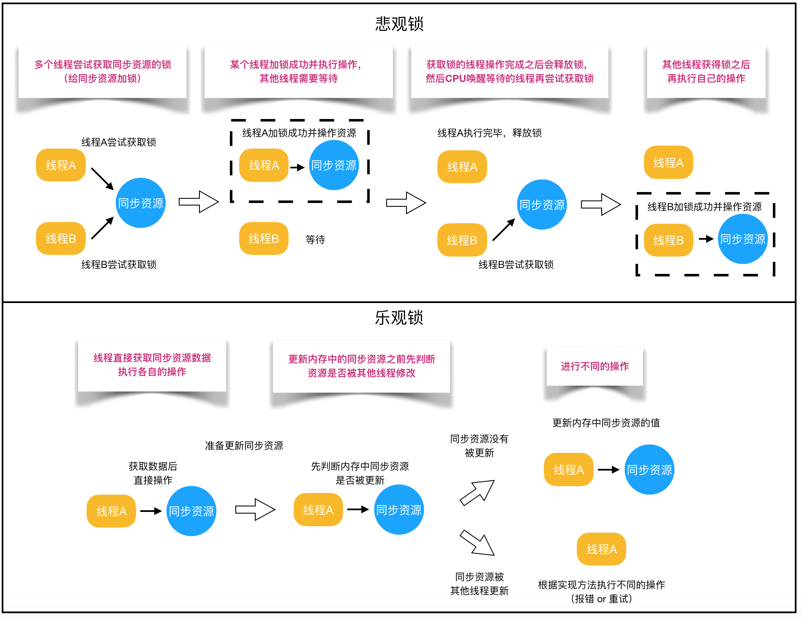
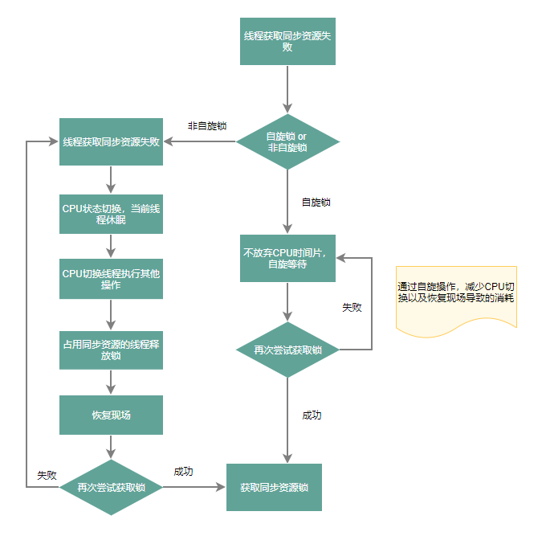
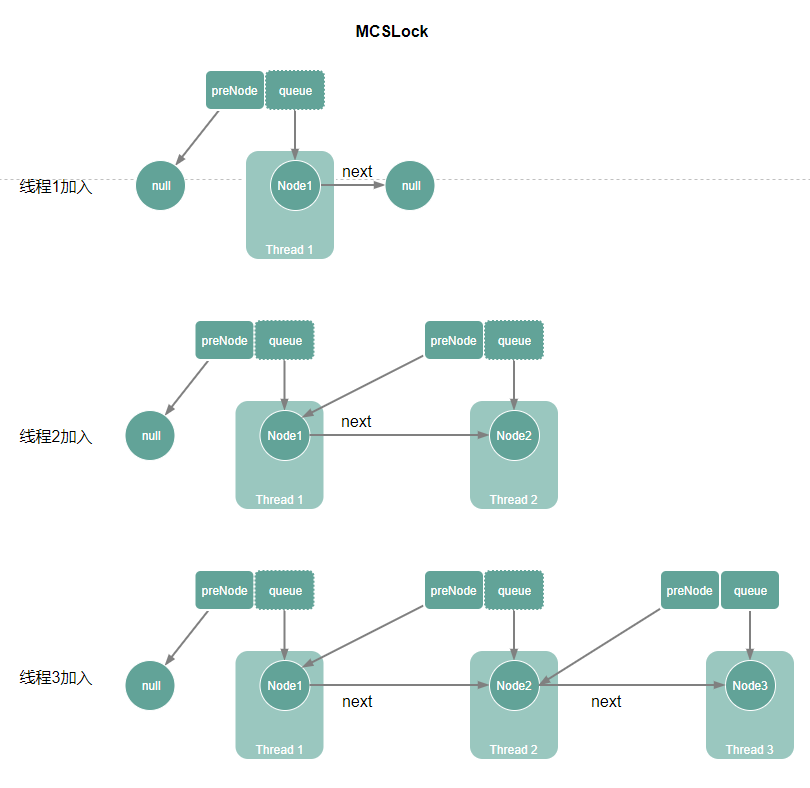
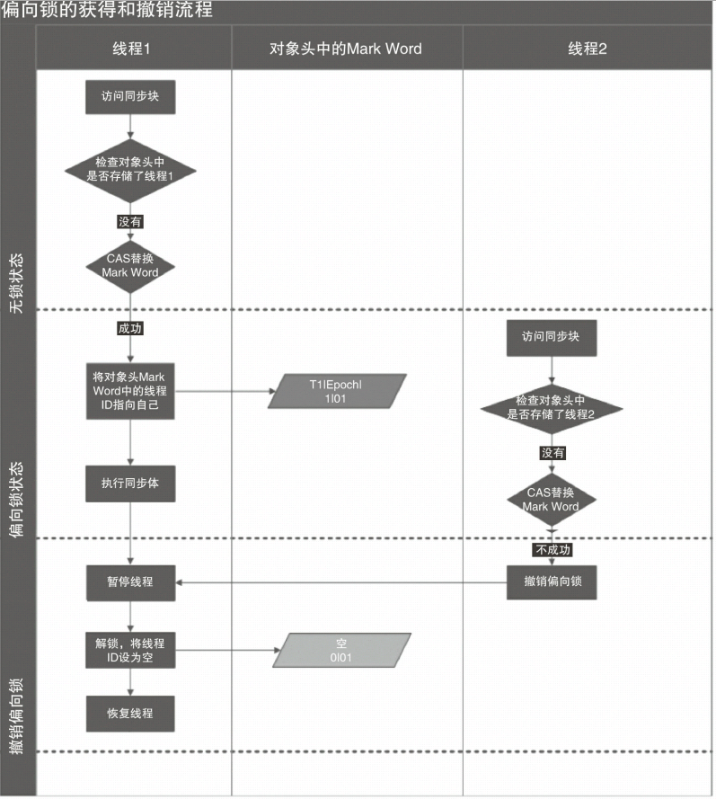
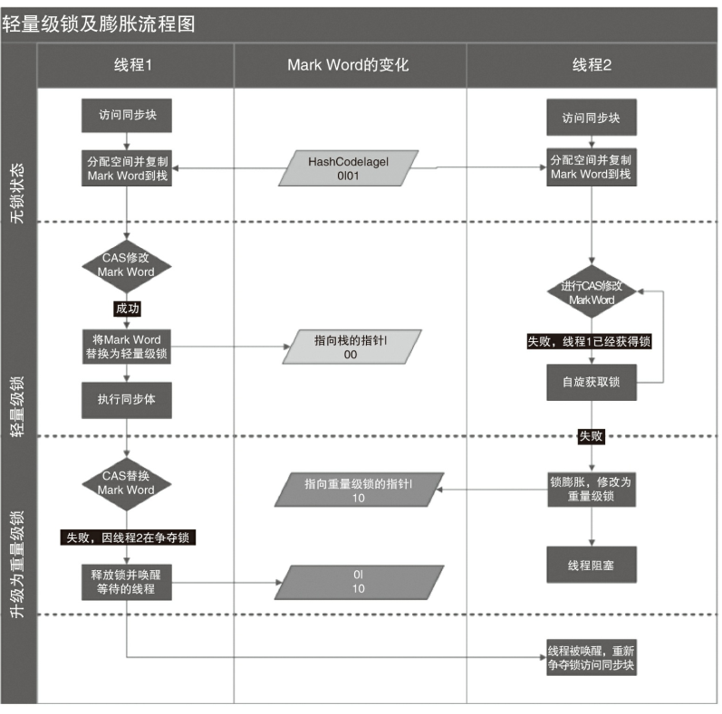

Java提供了种类丰富的锁，按照是否含有某一特性可以将锁进行分组归类，借用一张网上的图片。


(图片源自自https://tech.meituan.com/2018/11/15/java-lock.html)

## 1.悲观锁、乐观锁

### CAS算法介绍
乐观锁在Java中是通过使用无锁编程，最常采用的是CAS算法来实现的。这里先简单介绍下CAS算法。

>**CAS**全称 Compare And Swap（比较与交换），是一种无锁算法。在不使用锁（没有线程被阻塞）的情况下实现多线程之间的变量同步。
java.util.concurrent包中的原子类就是通过CAS来实现了乐观锁。
>
>CAS算法涉及到三个操作数：
>
>- 需要读写的内存值 V。
>- 进行比较的值 A。
>- 要写入的新值 B。
>
>当且仅当 V 的值等于 A 时，CAS通过原子方式用新值B来更新V的值（“比较+更新”整体是一个原子操作），否则不会执行任何操作。一般情况下，“更新”是一个不断重试的操作。

**CAS虽然很高效，但是它也存在三大问题，这里也简单说一下：**

>1. **ABA问题**。CAS需要在操作值的时候检查内存值是否发生变化，没有发生变化才会更新内存值。但是如果内存值原来是A，后来变成了B，然后又变成了A，那么CAS进行检查时会发现值没有发生变化，但是实际上是有变化的。ABA问题的解决思路就是在变量前面添加版本号，每次变量更新的时候都把版本号加一，这样变化过程就从“A－B－A”变成了“1A－2B－3A”。
 JDK从1.5开始提供了AtomicStampedReference类来解决ABA问题，具体操作封装在compareAndSet()中。compareAndSet()首先检查当前引用和当前标志与预期引用和预期标志是否相等，如果都相等，则以原子方式将引用值和标志的值设置为给定的更新值。
> 2. **循环时间长开销大**。CAS操作如果长时间不成功，会导致其一直自旋，给CPU带来非常大的开销。
> 3. **只能保证一个共享变量的原子操作**。对一个共享变量执行操作时，CAS能够保证原子操作，但是对多个共享变量操作时，CAS是无法保证操作的原子性的。
 Java从1.5开始JDK提供了AtomicReference类来保证引用对象之间的原子性，可以把多个变量放在一个对象里来进行CAS操作。

### 悲观锁和乐观锁的实现

对于同一个数据的并发操作
- **悲观锁** 认为自己在使用数据的时候一定有别的线程来修改数据，因此在获取数据的时候会先加锁，确保数据不会被别的线程修改。
- **乐观锁** 认为自己在使用数据时不会有别的线程修改数据，所以不会添加锁，只是在更新数据的时候去判断之前有没有别的线程更新了这个数据。
如果这个数据没有被更新，当前线程将自己修改的数据成功写入。如果数据已经被其他线程更新，则根据不同的实现方式执行不同的操作（例如报错或者自动重试）

借用下[美团技术团队博客](https://tech.meituan.com/2018/11/15/java-lock.html) 的图来展示下乐观锁和悲观锁的流程。


**1.2特点分析**

根据从上面的概念描述我们可以发现：
- 悲观锁适合写操作多的场景，先加锁可以保证写操作时数据正确。
- 乐观锁适合读操作多的场景，不加锁的特点能够使其读操作的性能大幅提升。
- 缺点是在使用时需要注意CAS带来的三个问题的处理

**1.3应用示例**
```java
// ------------------------- 悲观锁的调用方式 -------------------------
// synchronized
public synchronized void testMethod() {
	// 操作同步资源
}

// ReentrantLock
private ReentrantLock lock = new ReentrantLock(); // 需要保证多个线程使用的是同一个锁
public void modifyPublicResources() {
	lock.lock();
	// 操作同步资源
	lock.unlock();
}

// ------------------------- 乐观锁的调用方式 -------------------------
private AtomicInteger aint = new AtomicInteger(100);// 需要保证多个线程使用的是同一个AtomicInteger
boolean b = aint.compareAndSet(100,200); // 修改expect与当前值不同测试
if (b) {
	// 成功获取锁，操作同步资源
}
```
## 2.自旋锁、适应性自旋锁


### 自旋锁的原理与特点

**2.1自旋实现原理**

阻塞或唤醒一个Java线程需要操作系统切换CPU状态来完成，这种状态转换需要耗费处理器时间。如果同步代码块中的内容过于简单，状态转换消耗的时间有可能比用户代码执行的时间还要长。

在许多场景中，同步资源的锁定时间很短，为了这一小段时间去切换线程，线程挂起和恢复现场的花费可能会让系统得不偿失。如果物理机器有多个处理器，能够让两个或以上的线程同时并行执行，我们就可以让后面那个请求锁的线程不放弃CPU的执行时间，看看持有锁的线程是否很快就会释放锁。

自旋锁是针对锁同步资源失败的时候，线程不进行阻塞，而是通过自旋操作，减少CPU切换的方式继续尝试获取锁的一种加锁方式。

自旋锁在JDK1.4.2中引入，使用-XX:+UseSpinning来开启。JDK 6中变为默认开启，并且引入了自适应的自旋锁（适应性自旋锁）。自适应意味着自旋的时间（次数）不再固定，而是由前一次在同一个锁上的自旋时间及锁的拥有者的状态来决定。

**自旋锁与非自旋锁流程图**



**2.2特点分析**

- 适合锁操作时间较短的操作
- 使用过程中需要注意自旋次数和时间

**2.3自旋锁应用示例**
```java
public class SpinLock {

    // 当前占用锁的对象
    private AtomicReference<Thread> owner = new AtomicReference<>();

    public boolean lock() {
        Thread current = Thread.currentThread();
        while (!owner.compareAndSet(null, current)) { // 获取失败则自旋
        	// 此处可以加上超时时间或者次数的控制，避免一直自旋
        }
        return true;
    }

    public void unlock() {
        Thread current = Thread.currentThread();
        if (!owner.compareAndSet(current, null)) {
            throw new RuntimeException("release lock exception");
        }
        System.out.println("release lock success");
    }
}
```

### 自旋锁的经典示例

**TicketLock**
```java
public class TicketLock {

    // 排队获取ticket的编号
    private AtomicInteger ticketNum = new AtomicInteger();

    // 当前处理的ticket编号
    private AtomicInteger currentHandleTicket = new AtomicInteger(1);// 第一个待处理的人 获取的ticket的编号为1

    // 每个线程自己当前申请的ticket编号
    private ThreadLocal<Integer> currentTicket = new ThreadLocal<>();

    public void lock() {
        int currentTicketNum = ticketNum.incrementAndGet(); // 取号
        currentTicket.set(currentTicketNum);
        while (currentTicketNum != currentHandleTicket.get()){ // 取号之后比较自己的号码和当前处理号码是否一致，不一致进行自旋

        }
    }

    public void unlock() {
        Integer ticketNum = currentTicket.get();
        if(!currentHandleTicket.compareAndSet(ticketNum, ticketNum + 1)) { // 呼叫下一个编号的人(即，当前处理编号加1)
            throw new RuntimeException("release lock exception");
        }
        System.out.println("release lock success");
    }

    public void remove() {
        currentTicket.remove();
    }
}
```


```java
public class CLHLock {

    public static class CLHNode {
        private volatile boolean isLocked = true;
    }

    // 尾部节点
    private volatile CLHNode tail;

    private static final ThreadLocal<CLHNode> LOCAL = new ThreadLocal<>();

    private static final AtomicReferenceFieldUpdater<CLHLock, CLHNode> UPDATER =
            AtomicReferenceFieldUpdater.newUpdater(CLHLock.class, CLHNode.class, "tail");


    public void lock() {
        // 新建节点并将节点与当前线程保存起来
        CLHNode node = new CLHNode();
        LOCAL.set(node);

        // 将新建的节点设置为尾部节点，并返回旧的节点（原子操作），这里旧的节点实际上就是当前节点的前驱节点
        CLHNode preNode = UPDATER.getAndSet(this, node);
        if (preNode != null) {
            // 前驱节点不为null表示当锁被其他线程占用，通过不断轮询判断前驱节点的锁标志位等待前驱节点释放锁
            while (preNode.isLocked) {

            }
        }
        // 如果不存在前驱节点，表示该锁没有被其他线程占用，则当前线程获得锁

        System.out.println("get lock success");
    }

    public void unlock() {
        // 获取当前线程对应的节点
        CLHNode node = LOCAL.get();
        // 如果队列里只有当前线程，则释放对当前线程的引用（for GC）。
        if (!UPDATER.compareAndSet(this, node, null)) {
            node.isLocked = false; // 如果还有后续线程,改变状态，让后续线程结束自旋
        }
    }

    public void remove() {
        LOCAL.remove();
    }
}
```


```java
public class MCSLock {

    public static class MCSNode {
        volatile MCSNode next;
        volatile boolean isLocked = false;
    }

    private static final ThreadLocal<MCSNode> NODE = new ThreadLocal<>();

    // 队列
    private volatile MCSNode queue;

    private static final AtomicReferenceFieldUpdater<MCSLock,MCSNode> UPDATE =
            AtomicReferenceFieldUpdater.newUpdater(MCSLock.class,MCSNode.class,"queue");


    public void lock(){
        // 创建节点并保存到ThreadLocal中
        MCSNode currentNode = new MCSNode();
        NODE.set(currentNode);

        // step1: 将queue设置为当前节点，并且返回之前的节点
        MCSNode preNode = UPDATE.getAndSet(this, currentNode);
        if (preNode != null) {
            // step2: 如果之前节点不为null，表示锁已经被其他线程持有
            preNode.next = currentNode;
            // 循环判断，直到当前节点的锁标志位为true
            while (!currentNode.isLocked) {
            }
        }
    }

    public void unlock() {
        MCSNode currentNode = NODE.get();

        if (currentNode.next == null) { // next为null表示没有正在等待获取锁的线程
            // 更新状态并设置queue为null
            if (UPDATE.compareAndSet(this, currentNode, null)) {
                // 如果成功了，表示queue==currentNode,即当前节点后面没有节点了，释放锁成功
                return;
            } else {
                // 如果不成功，表示queue!=currentNode,即当前节点后面多了一个节点，表示有线程在等待
                // 如果当前节点的后续节点为null，则需要等待其不为null，
                // 这里之所以要等是因为：step1 执行完后，step2 可能还没执行完
                while (currentNode.next == null) {
                }
                // 释放锁，让后面的人继续
                currentNode.next.isLocked = true;
                currentNode.next = null;
            }
        } else { 
            // 如果不为null，表示有线程在等待获取锁，此时将等待线程对应的节点锁状态更新为true，
        	// 让他可以结束自旋获取到锁，同时将当前线程的后继节点设为null
            currentNode.next.isLocked = true;
            currentNode.next = null;
        }
    }

}
```


## 3.锁状态

锁的状态分为 无锁、偏向锁、轻量级锁、重量级锁 四种 ，是专门针对 synchronized 的。

### 3.1 对象头

对象头主要是由MarkWord和Klass Point(类型指针)组成，
其中 Klass Point 是对象指向它的类元数据的指针，虚拟机通过这个指针来确定这个对象是哪个类的实例，
Mark Word 用于存储对象自身的运行时数据。如果对象是数组对象，那么对象头占用3个字宽（Word），如果对象是非数组对象，那么对象头占用2个字宽。（1word = 2 Byte = 16 bit）
Synchronized锁对象存在对象头的MarkWord中。

在32位的虚拟机中，对象头里面的MarkWord的结构如下：


在64位的虚拟机中，其结构如下


### 3.2 Monitor

Monitor可以理解为一个同步工具或一种同步机制，通常被描述为一个对象。每一个Java对象就有一把看不见的锁，称为内部锁或者Monitor锁。

Monitor是线程私有的数据结构，每一个线程都有一个可用monitor record列表，同时还有一个全局的可用列表。每一个被锁住的对象都会和一个monitor关联，同时monitor中有一个Owner字段存放拥有该锁的线程的唯一标识，表示该锁被这个线程占用。

synchronized通过Monitor来实现线程同步，Monitor是依赖于底层的操作系统的Mutex Lock（互斥锁）来实现的线程同步，以下是更加详细的说明。

::: details
Synchronized`代码块同步`在需要同步的代码块开始的位置插入`monitorentry`指令，在同步结束的位置或者异常出现的位置插入`monitorexit`指令；
JVM要保证monitorentry和monitorexit都是成对出现的，任何对象都有一个monitor与之对应，当这个对象的monitor被持有以后，它将处于锁定状态。

Synchronized`方法同步`不再是通过插入monitorentry和monitorexit指令实现，而是由方法调用指令来读取运行时常量池中的ACC_SYNCHRONIZED标志隐式实现的，
如果方法表结构（method_info Structure）中的ACC_SYNCHRONIZED标志被设置，那么线程在执行方法前会先去获取对象的monitor对象，如果获取成功则执行方法代码，
执行完毕后释放monitor对象，如果monitor对象已经被其它线程获取，那么当前线程被阻塞。
:::

### 3.3 锁升级过程

锁升级的过程就是锁状态在 无锁、偏向锁、轻量级锁、重量级锁之前变换的过程。

每个阶段的锁的资源消耗量是逐级递增的。这几个状态会随着竞争逐渐升级，这里要注意，这些锁 **不能降级。**

为什么不能降级，这是因为锁升级和降级是有资源消耗的，频繁的升降级锁，资源的消耗会更严重，这样就得不偿失。
如果偏向锁升级成轻量级锁后没有再次触发升级，说明该资源竞争不激烈，轻量级锁也够用。如果持续升级到重量级锁，
说明竞争非常激烈，此时要对各个等待的线程做相应的处理，比如线程的挂起和唤醒。

详细的锁升级流程图请参考：[Synchronized锁升级过程详解](https://qtalex.com/synchronizedsuo-sheng-ji-guo-cheng-xiang-jie/)

不想翻阅的可以只看本文，简单梳理下：

**1 无锁** 

无锁没有对资源进行锁定，所有的线程都能访问并修改同一个资源，但同时只有一个线程能修改成功。


**2 偏向锁**

偏向锁是指一段同步代码一直被一个线程所访问，那么该线程会自动获取锁，降低获取锁的代价。

在大多数情况下，锁总是由同一线程多次获得，不存在多线程竞争，所以出现了偏向锁。其目标就是在只有一个线程执行同步代码块时能够提高性能。
偏向锁主要是通过CAS将mark word的线程ID指向当前线程，以此来获取锁。获取锁成功修改 是否偏向锁为1，锁标志位01 ，mark word的线程ID指向当前线程。

偏向锁只有**遇到其他线程尝试竞争偏向锁时，持有偏向锁的线程才会释放锁，线程不会主动释放偏向锁。**
偏向锁的撤销，需要等待全局安全点（在这个时间点上没有字节码正在执行），它会首先暂停拥有偏向锁的线程，判断锁对象是否处于被锁定状态。
撤销偏向锁后恢复到无锁（标志位为“01”）或轻量级锁（标志位为“00”）的状态。

偏向锁在JDK 6及以后的JVM里是默认启用的。可以通过JVM参数关闭偏向锁：-XX:-UseBiasedLocking=false，关闭之后程序默认会进入轻量级锁状态。


**3 轻量级锁**

轻量级锁的出现说明有多个线程在竞争了，此时未获得锁的线程将进入自旋状态，如果自旋到一定程度，锁将会升级。
毕竟线程自旋是要消耗CPU的，升级锁之后线程会被挂起，等待唤醒，这样就可以减少资源的消耗。


**4 重量级锁**

若当前只有一个等待线程，则该线程通过自旋进行等待。但是当自旋超过一定的次数，或者一个线程在持有锁，一个在自旋，又有第三个来访时，轻量级锁升级为重量级锁。
重量级锁通过对象内部的监视器（monitor）实现，其中monitor的本质是依赖于底层操作系统的Mutex Lock实现，操作系统实现线程之间的切换需要从用户态到内核态的切换，切换成本非常高。


整体流程图：





## 4.公平锁、非公平锁

公平锁是指多个线程按照申请锁的顺序来获取锁，线程直接进入队列中排队，队列中的第一个线程才能获得锁。

- 优点：等待锁的线程不会饿死。
- 缺点：整体吞吐效率相对非公平锁要低，等待队列中除第一个线程以外的所有线程都会阻塞，CPU唤醒阻塞线程的开销比非公平锁大。

非公平锁是多个线程加锁时直接尝试获取锁，获取不到才会到等待队列的队尾等待。但如果此时锁刚好可用，那么这个线程可以无需阻塞直接获取到锁，
所以非公平锁有可能出现后申请锁的线程先获取锁的场景。

- 优点：可以减少唤起线程的开销，整体的吞吐效率高，因为线程有几率不阻塞直接获得锁，CPU不必唤醒所有线程。
- 缺点：处于等待队列中的线程可能会饿死，或者等很久才会获得锁。


应用示例
ReentrantLock中对于公平和非公平的实现代码上差异
```java
protected final boolean tryAcquire(int acquires) {
    final Thread current = Thread.currentThread();
    int c = getState();
    if (c == 0) {
        if (!hasQueuedPredecessors() &&
            compareAndSetState(0, acquires)) {
            setExclusiveOwnerThread(current);
            return true;
        }
    }
    else if (current == getExclusiveOwnerThread()) {
        int nextc = c + acquires;
        if (nextc < 0)
            throw new Error("Maximum lock count exceeded");
        setState(nextc);
        return true;
    }
    return false;
}

final boolean nonfairTryAcquire(int acquires) {
    final Thread current = Thread.currentThread();
    int c = getState();
    if (c == 0) {
        if (compareAndSetState(0, acquires)) {
            setExclusiveOwnerThread(current);
            return true;
        }
    }
    else if (current == getExclusiveOwnerThread()) {
        int nextc = c + acquires;
        if (nextc < 0) // overflow
            throw new Error("Maximum lock count exceeded");
        setState(nextc);
        return true;
    }
    return false;
}
```

可以看到两个的差别就在于是否调用了 hasQueuedPredecessors() 方法，这个方法代码看一下发现就是检测是否轮到当前的线程了


## 5.可重入锁、非可重入锁

可重入锁又名递归锁，是指在同一个线程在外层方法获取锁的时候，再进入该线程的内层方法会自动获取锁（前提锁对象得是同一个对象或者class），
不会因为之前已经获取过还没释放而阻塞，专注的点是线程。

应用示例

synchronized 和 ReentrantLock 就是典型的应用，这里简单说明一下 ReentrantLock 重入的原理, 看之前 tryAcquire的源码时候，不难发现
 当竞争锁的线程是当前持有所的线程的是，直接操作 `volatile int state` 这个变量+1， 重入就是通过这个state来实现的。更加详细的细节，
 有兴趣可以在仔细看看源码。

## 6.共享锁、独享锁

独享锁也叫排他锁，是指该锁一次只能被一个线程所持有。如果线程T对数据A加上排它锁后，则其他线程不能再对A加任何类型的锁。获得排它锁的线程即能读数据又能修改数据。

共享锁是指该锁可被多个线程所持有。**如果线程T对数据A加上共享锁后，则其他线程只能对A再加共享锁，不能加排它锁**。获得共享锁的线程只能读数据，不能修改数据。

应用示例

java中的 ReentrantReadWriteLock 就是典型的应用

---

参考资料：

- [不可不说的Java“锁”事](https://tech.meituan.com/2018/11/15/java-lock.html)
- [看完你就明白的锁系列之自旋锁](https://juejin.im/post/6844903967185436679)
- [Java并发——Synchronized关键字和锁升级，详细分析偏向锁和轻量级锁的升级](https://blog.csdn.net/tongdanping/article/details/79647337)
- [Synchronized锁升级过程详解](https://qtalex.com/synchronizedsuo-sheng-ji-guo-cheng-xiang-jie/)
- [图文深入解析 JAVA 读写锁，为什么读锁套写锁会死锁，反过来却不会？](https://my.oschina.net/anur/blog/3061764)

