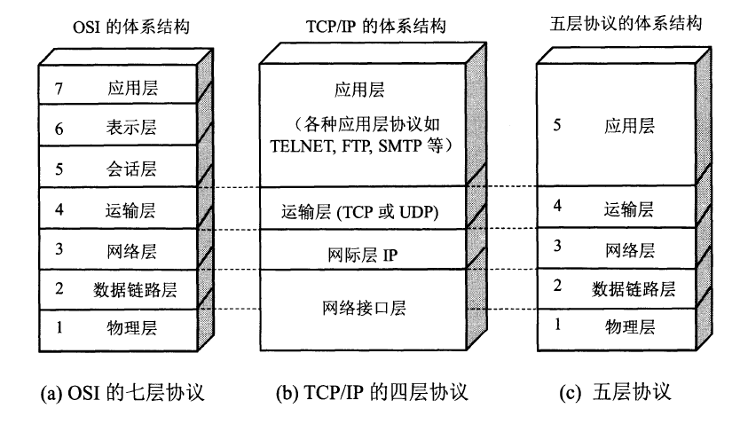
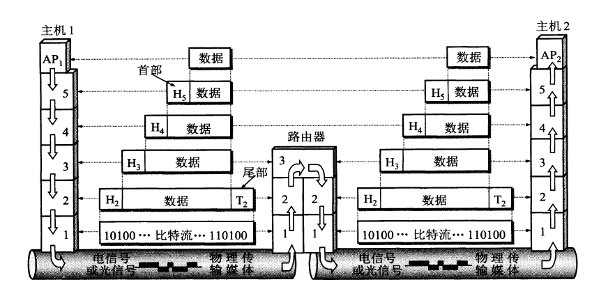
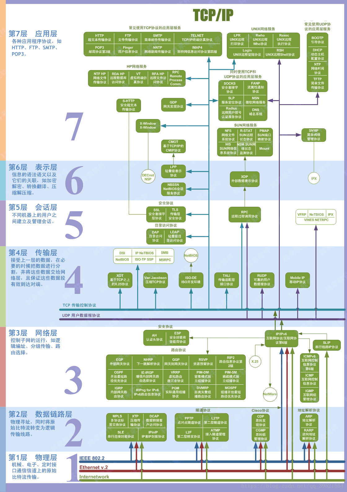

# 计算机网络的分层协议

经常在遇到网络分层问题的时候就非常的模糊，发现有很多说法，主要的有以下三种。

- OSI七层模型
- 五层协议模型
- TCP/IP四层协议

那么网络模型到底是几层的呢 ？ 下面依次来看看几种分层的含义。

## 分层总览

### 概括
- **OSI 七层协议**：(Open System Interconnect)开放系统互联定义的网络分层模型，比较的细致复杂。网络互联理论上的标准
- **TCP/IP 四层协议**：网络互联事实上的标准。
- **五层协议**：方便学习计算机网络原理采取的一种折中的方式，综合了7层和3层协议的有点提出的一种分层体系。

### 各种分层系统结构图

## 各层主要作用

这里简单总结下各层的主要作用，学习中计算网络，如上文提到，按照5层协议来看。

### 1. 物理层（physical layer)

在物理层上所传数据的单位是比特。发送方发送1（或0）时，接收方应当收到1（或 0）而不是0（或1)。因此物理层要考虑用多大的电压代表“1”或“0"，
以及接收方如何识别出发送方所发送的比特。物理层还要确定连接电缆的插头应当有多少根引脚以及各引脚应如何连接。当然，解释比特代表的意思，就不是物理层的任务。
请注意，传递信息所利用的一些物理媒体，如双绞线、同轴电缆、光缆、无线信道等，并不在物理层协议之内而是在物理层协议的下面。因此也有人把物理层下面的物理媒介当作第0层。

### 2. 数据链路层（data link layer)

数据链路层常简称为**链路层**。我们知道，两台主机之间的数据传输，总是在一段一段 的链路上传送的，这就需要使用专门的链路层的协议。
在两个相邻结点之间传送数据时，数据链路层将网络层交下来的IP数据报组装成帧（framing)，在两个相邻结点间的链路上传送帧（frame)。
每一帧包括数据和必要的控制信息（如同步信息、地址信息、差错控制等）。 

在接收数据时，控制信息使接收端能够知道一个帧从哪个比特开始和到哪个比特结束。这样，数据链路层在收到一个帧后，就可从中提取出数据部分，上交给网络层。 

控制信息、还使接收端能够检测到所收到的帧中有无差错。如发现有差错，数据链路层就简单地丢弃这个出了差错的帧，以免继续在网络中传送下去白白浪费网络资源。
如果需要改正数据在数据链路层传输时出现的差错（这就是说，数据链路层不仅要检错，而且要纠错），
那么就要采用可靠传输协议来纠正出现的差错。这种方法会使数据链路层的协议复杂些。 

### 3. 网络层（network layer)
 
网络层负责为分组交换网上的不同**主机**提供通信服务。在发送数据时，网络层把运输层产生的报文段或用户数据报封装成分组或包进行传送。
在TCP/IP体系中，由于网络层使用IP协议，因此分组也叫做`IP数据报`，或简称为数据报。

*请注意：不要将运输层的“用户数据报UDP”和网络层的“IP数据报”弄混。此外， 无论在哪一层传送的数据单元，都可笼统地用“分组”来表示。* 

网络层的另一个任务就是要选择合适的路由，使源主机运输层所传下来的分组，能够 通过网络中的路由器找到目的主机。 

这里要强调指出，网络层中的“网络”二字，已不是我们通常谈到的具体网络，而是在计算机网络体系结构模型中的第3层的名称。 

互联网是由大量的异构（heterogeneous）网络通过路由器（router）相互连接起来的。互联网使用的网络层协议是无连接的网际协议IF (Internet Protocol）和许多种路由选择协议，
因此互联网的网络层也叫做网际层或IP层。 

### 4. 运输层（transport layer)
 
运输层的任务就是负责向两台主机中进程之间的通信提供通用的数据传输服务。应用进程利用该服务传送应用层报文。所谓“通用的”，是指并不针对某个特定网络应用，
而是多种应用可以使用同一个运输层服务。由于一台主机可同时运行多个进程，因此运输层有复用和分用的功能。复用就是多个应用层进程可同时使用下面运输层的服务，
分用和复用相反，是运输层把收到的信息分别交付上面应用层中的相应进程。 

运输层主要使用以下两种协议： 
- 传输控制协议TCP (Transmission Control Protocol)―提供面向连接的、可靠的数 据传输服务，其数据传输的单位是报文段（segment)。 
- 用户数据报协议UDP (User Datagram Protocol)―提供无连接的、尽最大努力 (best-effort)的数据传输服务（不保证数据传输的可靠性），其数据传输的单位是用 户数据报。 

顺便指出，有人愿意把运输层称为传输层，理由是这一层使用的TCP协议就叫做传输控制协议。从意思上看，传输和运输差别也不大。
但OSI定义的第4层使用的是 Transport，而不是Transmission。这两个字的含义还是有些差别。因此，使用运输层这个译名较为准确。 

### 5. 应用层（application layer)

应用层是体系结构中的最高层。应用层的任务是通过应用进程间的交互来完成特定网 络应用。应用层协议定义的是应用进程间通信和交互的规则。
这里的进程就是指主机中正在运行的程序。对于不同的网络应用需要有不同的应用层协议。在互联网中的应用层协议很多，
如域名系统DNS，支持万维网应用的HTTP协议，支持电子邮件的SMTP协议，等等。我们把应用层交互的数据单元称为报文（message)。 

## 各层协调

### 数据传输图解

数据在各层之前的传输如下图：

### http示例图解

以http数据报文为例的传输路径如下图：

### 经典图解

最后，来一张经典图结尾

