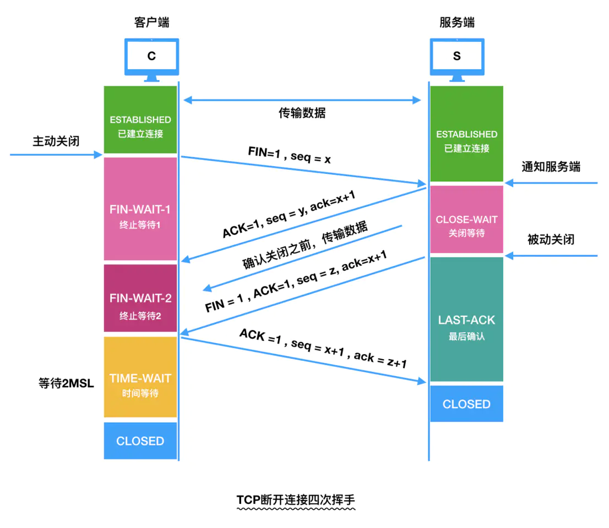

# TCP三次握手与四次挥手

>【转载】 原文连接 [https://juejin.cn/post/6844903913611591688](https://juejin.cn/post/6844903913611591688)

## 前言
TCP的三次握手🤝建立连接和四次挥手👋断开连接，相信很多人都听说过，也都看过相关的内容，本篇是为了记录自己对与这两种操作的理解。
在进入正式内容之前，先来看几个符号的概念：

- **`序列号seq`**： 用来标记数据段的顺序，TCP把连接中发送的所有数据字节都编上一个序号，第一个字节的编号由本地随机产生；给字节编上序号后，就给每一个报文段指派一个序号；序列号seq就是这个报文段中的第一个字节的数据编号。
- **`确认号ack`**： 期待收到对方下一个报文段的第一个数据字节的序号；序列号表示报文段携带数据的第一个字节的编号；而确认号指的是期望接收到下一个字节的编号；因此当前报文段最后一个字节的编号+1即为确认号。
- **`确认ACK`**： 仅当ACK=1时，确认号字段才有效。ACK=0时，确认号无效
- **`同步SYN`**： 连接建立时用于同步序号。当SYN=1，ACK=0时表示：这是一个连接请求报文段。若同意连接，则在响应报文段中使得SYN=1，ACK=1。因此，SYN=1表示这是一个连接请求，或连接接受报文。SYN这个标志位只有在TCP建产连接时才会被置1，握手完成后SYN标志位被置0。
- **`终止FIN`**： 用来释放一个连接。FIN=1表示：此报文段的发送方的数据已经发送完毕，并要求释放运输连接

## 三次握手

首先进入一下情景：

我正在饭店里和朋友吃饭，喝的正嗨的时候，女朋友打电话过来，饭店里有很多人，环境原因听不太清电话里的声音：

我：能听到我的声音吗？

女：能听到，大点声，你能听到我讲话吗？

我：能听到，

如此这般，才能保证双方都能听到声音，才能继续对话呀。

TCP是面向连接的，无论哪一方向另一方发送数据之前，都必须先在双方之间建立一条连接。在TCP/IP协议中，TCP 协议提供可靠的连接服务，
连接是通过三次握手🤝进行初始化的。三次握手🤝的目的是同步连接双方的序列号和确认号并交换 TCP窗口大小信息。由此我们来对应客户端与服务器之间的建立连接：

- 第一次握手🤝： 客户端向服务器发出连接请求报文，这时报文首部中的同部位SYN=1，同时随机生成初始序列号 seq=x，此时，客户端进程进入了 SYN-SENT状态，等待服务器的确认。
- 第二次握手🤝： 服务器收到请求报文后，如果同意连接，则发出确认报文。确认报文中应该 ACK=1，SYN=1，确认号是ack=x+1，同时也要为自己随机初始化一个序列号 seq=y，此时，服务器进程进入了SYN-RCVD状态，询问客户端是否做好准备。
- 第三次握手🤝：  客户端进程收到确认后，还要向服务器给出确认。确认报文的ACK=1，ack=y+1，此时，连接建立，客户端进入ESTABLISHED状态，服务器端也进入ESTABLISHED状态。

以上就是三次握手🤝的一个大概流程，那么问题来了：

**握手🤝为什么需要三次呢，如果把最后一次的去掉改为两次握手🤝是否可行呢?**

假如现在客户端想向服务端进行握手，它发送了第一个连接的请求报文，但是由于网络信号差或者服务器负载过多，这个请求没有立即到达服务端，
而是在某个网络节点中长时间的滞留了，以至于滞留到客户端连接释放以后的某个时间点才到达服务端，那么这就是一个失效的报文，
但是服务端接收到这个失效的请求报文后，就误认为客户端又发了一次连接请求，服务端就会想向客户端发出确认的报文，表示同意建立连接。

假如不采用三次握手，那么只要服务端发出确认，表示新的建立就连接了。但是现在客户端并没有发出建立连接的请求，其实这个请求是失效的请求，
一切都是服务端在自相情愿，因此客户端是不会理睬服务端的确认信息，也不会向服务端发送确认的请求，但是服务器却认为新的连接已经建立起来了，并一直等待客户端发来数据，
这样的情况下，服务端的很多资源就没白白浪费掉了。

采用三次握手的办法就是为了防止上述这种情况的发生，比如就在刚才的情况下，客户端不会向服务端发出确认的请求，服务端会因为收不到确认的报文，
就知道客户端并没有要建立连接，那么服务端也就不会去建立连接，这就是三次握手的作用。

## 四次挥手

来，再次进入以下情景：

假如有一天我想要自由了，我就跟我的女朋友提出分手的要求：

我：我要自由，自由万岁，分手吧

女：好，你要分手是吧

然后她会骂我渣啊来发泄，或者试图挽留，在经过冷静之后：

女：那就这样吧，分

我：好的，分

至此就各奔东西，互相安好，相忘于江湖。

当客户端和服务器通过三次握手建立了TCP连接以后，当数据传送完毕，为了防止资源浪费肯定要断开TCP连接，那对于TCP的断开连接，这里就有了断开连接的四次挥手。

- 第一次挥手👋：  客户端进程发出连接释放FIN报文，并且停止发送数据。释放数据报文首部，FIN=1，其序列号为seq=x,此时，客户端进入FIN-WAIT-1（终止等待1）状态。
- 第二次挥手👋：  服务端进程收到连接释放FIN报文，发出确认ACK报文，ACK=1，ack=x+1，并且带上自己的序列号seq=y，此时，服务端就进入了CLOSE-WAIT（关闭等待）状态。此时，服务端通知高层的应用进程，客户端向服务端的方向就释放了，这时候处于半关闭状态，即客户端已经没有数据要发送了，但是服务端若发送数据，客户端依然要接受。这个状态还要持续一段时间，也就是整个CLOSE-WAIT状态持续的时间。客户端收到服务端的确认请求后，此时，客户端就进入FIN-WAIT-2（终止等待2）状态，等待服务器发送连接释放报文，在这之前依然可以接收服务端发送过来的最后的数据。
- 第三次挥手👋： 服务端将最后的数据发送给客户端完成后，就向客户端发送连接释放FIN报文，FIN=1，ack=x+1，此时的序列号为seq=z，此时，服务端就进入了LAST-ACK（最后确认）状态，等待客户端的确认。
- 第四次挥手👋： 客户端接收到服务端的连接释放FIN报文后，必须发出确认报文，ACK=1，ack=z+1，而自己的序列号是seq=x+1，此时，客户端就进入了TIME-WAIT（时间等待）状态。此时服务端收到客户端发送过来的确认报文，就立即撤销自己的传输控制块TCB,进入CLOSED状态，注意此时的TCP连接还没有释放，必须经过2MSL（最长报文段寿命）的时间后，客户端没有收到服务端发来的任何数据，证明服务端已正常关闭，此时客户端会撤销相应传输控制块TCB后，进入CLOSED状态。至此，TCP的连接才真正的断开了。（服务端结束TCP连接的时间要比客户端稍微早一些）

好的，那么问题又来了：

**为什么断开连接需要四次挥手👋呢，像建立连接的时候一样，三次行不行呢？**

TCP协议是一种面向连接的、可靠的、基于字节流的运输层通信协议。TCP是全双工 模式，这就意味着，在客户端想要断开连接时，客户端向服务端发送FIN报文，
只是表示客户端已经没有数据要发送了，但是这个时候客户端还是可以接收来自服务端的数据。

当服务端接收到FIN报文，并返回ACK报文，表示服务端已经知道了客户端要断开连接，客户端已经没有数据要发送了，但是这个时候服务端可能依然有数据要传输给客户端。

当服务端的数据传输完之后，服务端会发送FIN报文给客户端，表示服务端也没有数据要传输了，服务端同意关闭连接，之后，客户端收到FIN报文，立即发送给客户端一个ACK报文，确定关闭连接。
在之后，客户端和服务端彼此就愉快的断开了这次的TCP连接。

或许会有疑问，为什么服务端的ACK报文和FIN报文都是分开发送的，但是在三次握手的时候却是ACK报文和SYN报文是一起发送的，因为在三次握手的过程中，
当服务端收到客户端的SYN连接请求报文后，可以直接发送SYN+ACK报文。其中ACK报文是用来应答的，SYN报文是用来同步的。但是在关闭连接时，当服务端接收到FIN报文时，
很可能并不会立即关闭SOCKET，所以只能先回复一个ACK报文，告诉客户端，你发的FIN报文我收到了，只有等到服务端所有的数据都发送完了，才能发送FIN报文，
因此ACK报文和FIN报文不能一起发送。所以断开连接的时候才需要四次挥手来完成。

## 验证

下面通过Wireshark抓包工具来抓包看一下三次握手和四次挥手：

- 工具：Wireshark
- 下载地址  www.pc6.com/mac/112232.…

安装完成之后，打开Wireshark ，开始监测网络封包。

打开两个终端窗口，建立一个连接（这里很简单，就不截图了）：

在终端窗口1中，输入：nc -l 6060 回车

在终端窗口2中，输入：nc 127.0.0.1 6060 回车

两个终端建立连接之后，可以在Wireshark中看到三次握手的过程：

下面断开连接再来看一下四次挥手的过程：

如果对照前面的三次握手和四次挥手的过程图来看的话，更能明白此处的抓包到的数据。

## 总结
TCP的三次握手和四次挥手，个人觉得其实就是在建立连接和断开连接的时候，保证这个连接的“安全完整”。
同时也保证了数据的完整发送。至此关于TCP的三次握手和四次挥手就写到这里，如有错误还请指正！

>作者：Henry_Jeannie
>
>链接：https://juejin.cn/post/6844903913611591688
>
>来源：掘金
>
>著作权归作者所有。商业转载请联系作者获得授权，非商业转载请注明出处。