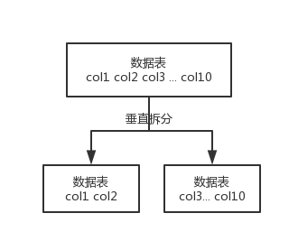

1. 分库分表一定是为了**支撑高并发、数据量大**两个问题的
2. 分库分表要考虑使用何种id策略
3. 分库分表要考虑如何做数据迁移，做好迁移方案
4. 分库分表的之后，数据量继续增加，预留不够的时候如果进行扩容
5. 评估分库分表后带来的问题，选择合理的方案来应对

<!-- more -->

# 谈一谈分库分表

## 1 为什么要分库分表

在谈分库分表之前，需要先明确两个概念，分库和分表，是两个不同的动作。当单库连接数过多或者单表数据量过大的时候，数据库的性能就会变差，影响业务响应速度，而分库和分表的根本目的就是解决数据库在性能上瓶颈。

在当今互联网行业，大量数据，很容易就会出现需要分库分表的场景。

- **分表**

比如你单表都几千万数据了，你确定你能扛住么？绝对不行，**单表数据量太大**，会极大影响你的 sql **执行的性能**，到了后面你的 sql 可能就跑的很慢了。一般来说，单表到几百万的时候，性能就会相对差一些了，你就得分表了。

分表是啥意思？就是把一个表的数据放到多个表中，然后查询的时候你就查一个表。比如按照用户 id 来分表，将一个用户的数据就放在一个表中。然后操作的时候你对一个用户就操作那个表就好了。这样可以控制每个表的数据量在可控的范围内，比如每个表就固定在 200 万以内。

- **分库**

分库是啥意思？就是你一个库一般我们经验而言，最多支撑到并发 2000，一定要扩容了，而且一个健康的单库并发值你最好保持在每秒 1000 左右，不要太大。那么你可以将一个库的数据拆分到多个库中，访问的时候就访问一个库好了。

这就是所谓的**分库分表**。

| #            | 分库分表前                   | 分库分表后                                   |
| ------------ | ---------------------------- | -------------------------------------------- |
| 并发支撑情况 | MySQL 单机部署，扛不住高并发 | MySQL 从单机到多机，能承受的并发增加了多倍   |
| 磁盘使用情况 | MySQL 单机磁盘容量几乎撑满   | 拆分为多个库，数据库服务器磁盘使用率大大降低 |
| SQL 执行性能 | 单表数据量太大，SQL 越跑越慢 | 单表数据量减少，SQL 执行效率明显提升         |

分库分表一定是为了**支撑高并发、数据量大**两个问题的

## 2 如何进行分库分表

分库分表一般的拆分原则有两种，一种是水平拆分、一种是垂直拆分，下面对两种拆分方式进行说明

### 2.1 水平切分

水平拆分，按照字面意思，水平切割，把数据分成多份。如果理解呢，想想数据表，有100行数据，从中间切开，各50行数据，切分后两份数据格式上是一致。这种及时水平切分

**水平切分的特点**：数据库的数据结构不发生变化，数据分不同组，根据分表算法，落到不同的分表（库）中。

**适用场景**：单表（库）数据比较多，切分后减少单次访问的搜索范围

### 2.2 垂直切分

垂直切割，按字面意思就是垂直方案切割，分成多份，多份之间通过某个信息关联，在需要时候可以联合切分的数据，还原完整数据。

如上实例，表中有很多数据列，对其记性拆分后，分为多个表。 实例中示例：用户表记录用户很多信息（很多列），这个时候按照用户id关联，会**将较少的访问频率很高的字段放到一个表里去**，然后**将较多的访问频率很低的字段放到另外一个表里去**。因为数据库是有缓存的，你访问频率高的行字段越少，就可以在缓存里缓存更多的行，性能就越好。这个一般在表层面做的较多一些。

**垂直切分特点：** 拆分高频低频，合理利用数据库缓存空间

**适用场景：** 表（库）数据结构比较复杂（列比较多），通过切割成不同的表（库）来提供效率

### 2.3 常用分库分表实践方案

水平切分和垂直切分实现时候有很多方案（分片策略），一般有以下几种

1. **按照 range 来分**：就是每个库一段连续的数据，这个一般是按比如**时间范围**来的，但是这种一般较少用，因为很容易产生热点问题，大量的流量都打在最新的数据上了。
2. **按照某个字段 hash/取模**  一下均匀分散，这个较为常用，例如 用户id(或者id的hashCode)取模

在实际生产中，有很多中间件可以借用，帮助我们完成整个分库分表的实现，比较常见的包括：

- Cobar
- TDDL
- Atlas
- Sharding-jdbc
- Mycat

**Cobar**

阿里 b2b 团队开发和开源的，属于 proxy 层方案，就是介于应用服务器和数据库服务器之间。应用程序通过 JDBC 驱动访问 Cobar 集群，Cobar 根据 SQL 和分库规则对 SQL 做分解，然后分发到 MySQL 集群不同的数据库实例上执行。早些年还可以用，但是最近几年都没更新了，基本没啥人用，差不多算是被抛弃的状态吧。而且不支持读写分离、存储过程、跨库 join 和分页等操作。

**TDDL**

淘宝团队开发的，属于 client 层方案。支持基本的 crud 语法和读写分离，但不支持 join、多表查询等语法。目前使用的也不多，因为还依赖淘宝的 diamond 配置管理系统。

**Atlas**

360 开源的，属于 proxy 层方案，以前是有一些公司在用的，但是确实有一个很大的问题就是社区最新的维护都在 5 年前了。所以，现在用的公司基本也很少了。

**Sharding-jdbc**

当当开源的，属于 client 层方案，是[ `ShardingSphere` ](https://shardingsphere.apache.org/)的 client 层方案，[ `ShardingSphere` ](https://shardingsphere.apache.org/)还提供 proxy 层的方案 Sharding-Proxy。确实之前用的还比较多一些，因为 SQL 语法支持也比较多，没有太多限制，而且截至 2019.4，已经推出到了 `4.0.0-RC1` 版本，支持分库分表、读写分离、分布式 id 生成、柔性事务（最大努力送达型事务、TCC 事务）。而且确实之前使用的公司会比较多一些（这个在官网有登记使用的公司，可以看到从 2017 年一直到现在，是有不少公司在用的），目前社区也还一直在开发和维护，还算是比较活跃，算是一个现在也**可以选择的方案**。

**Mycat**

基于 Cobar 改造的，属于 proxy 层方案，支持的功能非常完善，而且目前应该是非常火的而且不断流行的数据库中间件，社区很活跃，也有一些公司开始在用了。但是确实相比于 Sharding jdbc 来说，年轻一些，经历的锤炼少一些。

## 3 分库分表后的id问题

关于分库分表后id的问题，可以采用分布式id实现方案来解决，具体方案参见 [分布式：全局唯一ID实现方案](http://www.jnote.net/04-architecture/ds/010-ds-id.html) , 下面简单介绍下。

### 3.1 基于UUID生成id

使用UUID生成id, 保证所有分片的id不重复。

**优点**

- 生成方便，单机直接生成

**缺点**

- 不易存储，字段较长
- 对MySQL索引不友好
- 信息安全问题

### 3.2 基于数据库自增方案

利用数据库自增+固定步长 把id分散，具体方案和优劣请看 [分布式：全局唯一ID实现方案](http://www.jnote.net/04-architecture/ds/010-ds-id.html)

此方式另外还会存在扩容问题，下一节会说到

### 3.3分布式全局id算法方案

此类算法分为两类 ：分布式中心生成唯一id再分配，类snowflake算法，具体方案和优劣请看 [分布式：全局唯一ID实现方案](http://www.jnote.net/04-architecture/ds/010-ds-id.html)

- 分布式中心生成唯一id再分配：redis生成id、专门数据库序列中心
- 类snowflake算法：snowflake算法、百度UidGenerator、美团Leaf、腾讯Seqsvr 等

## 4 分库分表后如何过渡与迁移

分库分表后，一个直接要面对的问题就是老系统如果过渡和迁移，如果是新的系统，设计的时候直接分库分表了没有问题，老系统没有分库分表的话，要如果进行切换呢？

### 4.1 停机迁移

最简单便捷的方案就是停机迁移，期间服务不可用，如果能够容忍，则是一个不错的选择。例如在晚间挂上公告，系统升级中。然后编写一个数据导入工具，直接按照规则，把老数据导入到新的数据库和表中。部署新的服务，跑完收工。

这种方式优点就是简单，缺点及时需要停服务，如果有些业务服务不能接收停服，则此方案不行了。

### 4.2 双写迁移

双写方案，顾明意思，就是新老数据库（表同时写入数据），业务修改数据写入层逻辑，对数据执行双写，同时按照新规则和老规则写入数据。 这种方案实现起来比较的复杂，需要记录下修改时间，增量数据在新库（表）中同步写入了，但是历史数据的更新，则需要使用同步工具做一些校准，同时比对新库（表）确认为历史数据的修改，并把最新的数据导入到新库。实现起来考虑的点比较多。

**系统部署**之后，新库数据差太远，用之前说的导数工具，跑起来读老库数据写新库，写的时候要根据 gmt_modified 这类字段判断这条数据最后修改的时间，除非是读出来的数据在新库里没有，或者是比新库的数据新才会写。简单来说，就是不允许用老数据覆盖新数据。

导完一轮之后，有可能数据还是存在不一致，那么就程序自动做一轮校验，比对新老库每个表的每条数据，接着如果有不一样的，就针对那些不一样的，从老库读数据再次写。反复循环，直到两个库每个表的数据都完全一致为止。

此方案优点不用停服务，缺点就是对于历史数据修改的校准和导入问题比较复杂，需要做逻辑判断处理。

## 5 分库分表之后如何进行扩容

一般在设计分库分表大小的时候精良预估个3-5年的量，一般这个时间过后，系统也可能面临重构了。但是预估不一定就够，依然存在扩容的可能，所以分库分表后的扩容还是需要被考虑的。

分库分表之后的扩容问题会因采取的全局id方案、分片策略的不同而不同，下面针对不同情况分析一下

### 5.1 id策略对扩容影响

使用全局id生成法生成的全局id基本对扩容不会造成影响，扩容之后依然可以使用之前的策略生成id并使用。但是使用 **数据库自增id+固定步长** 方式生成id的，会在扩容时候有影响

假设原来分为3个表，步长为3 则id表现如下

table_0: 1, 4, 7, 10....

table_1: 2, 5, 8, 11...

table_2: 3, 6, 9, 12...

当此时需要扩张表，例如扩张到5张的时候，数据库id就需要处理下

此时可以有两种方式

1. 数据迁移，迁移完成后从一个新起点开始自增并设置步长为5 (id作为shardingKey)
2. 不迁移数据，从一个新起点开始自增并设置步长为5(id不是shardingKey)

### 5.2 分片策略对扩容的影响

由于分片策略不同，扩容之后需要保证已有数据分到正确的分片（库/表）里面, 则需要考虑分片策略对扩容影响

1. range分片，扩容基本不会有影响，例如按照时间（一个月或者一年一个分片）、用户id范围（0-100000,100000-200000）等
2. hash/mod 这种方式的影响比较大，例如原来分10片，用户id mod 10,  后来扩容到20 则mod 20 已有数据就需要处理下

无论是 id策略还是分片策略的影响，在扩容的时候都需要考虑，那么实际中该如何解决扩容的问题呢？下面来简单说明下。

### 5.3 动态扩容方案

参考：[分库分表平滑扩容](https://www.cnblogs.com/barrywxx/p/11532122.html)

- 方案1：数据迁移

  这种方案很好理解，基本思想就是按照新的规则，分库分表后，原有数据需要做迁移，而迁移方案就是利用前文提到的两种，如果业务可以接受停服，直接停服迁移，最为简单快捷。如果服务不允许停服，可以使用双写方案，把数据迁移到新的分表。

- 方案2：升级从库

  这个方案我这里直接借用 [分库分表平滑扩容](https://www.cnblogs.com/barrywxx/p/11532122.html) 文中的描述， 说明如下：

  线上数据库，我们为了保持其高可用，一般都会每台主库配一台从库，读写在主库，然后主从同步到从库。如下，A，B是主库，A0和B0是从库。

  

  此时，当需要扩容的时候，我们把A0和B0升级为新的主库节点，如此由2个分库变为4个分库。同时在上层的分片配置，做好映射，规则如下:

  > uid%4=0和uid%4=2的分别指向A和A0，也就是之前指向uid%2=0的数据，分裂为uid%4=0和uid%4=2
  >
  > uid%4=1和uid%4=3的指向B和B0，也就是之前指向uid%2=1的数据，分裂为uid%4=1和uid%4=3

  因为A和A0库的数据相同，B和B0数据相同，所以此时无需做数据迁移即可。只需要变更一下分片配置即可，通过配置中心更新，无需重启。

  

  由于之前uid%2的数据分配在2个库里面，此时分散到4个库中，由于老数据还存在（uid%4=0,还有一半uid%4=2的数据），所以需要对冗余数据做一次清理。

  而这个清理，不会影响线上数据的一致性，可是随时随地进行。

  处理完成以后，为保证高可用，以及下一步扩容需求。可以为现有的主库再次分配一个从库。

  

  总结一下此方案步骤如下：

  > 1. 修改分片配置，做好新库和老库的映射。
  > 2. 同步配置，从库升级为主库
  > 3. 解除主从关系
  > 4. 冗余数据清理
  > 5. 为新的数据节点搭建新的从库

## 6 分库分表后带来的问题

分库分表虽然能够帮我提升数据库层级的性能，帮助我们抗住更多连接和并发，但是选择使用了分库分表后，会带来很多必需要面对的问题。

最常见的就是**聚合查询类问题**和**分布式事务问题**。因此，我们不能为了分库分表而分库分表，任何事物产生都是有原因的，在决定是否使用分库分表的时候，要综合考虑是否真的业务量达到较高水平，数据库是否真的是瓶颈，业务上是否可能优化解决。

### 6.1 聚合查询问题

关于聚合类问题，主要是 join查询、按条件聚合查询、orderby(排序、分页) 等涉及到查询的数据来源于多个分片分问题（分片查询根据shardingKey来路由）。

一个典型的示例： 如果我们的订单是按照用户id 分表的，在C端查询时候主要以用户id为维度，直接定位到单表，没有问题，但是当在B端商户需要查询订单列表的时候，用户数据分散在不同表（shardingKey为用户id，不是订单号），此时数据就需要聚合，同时列表还存在排序分页的问题，更加难以处理。

分析问题原因：主要原因在于查询的数据是分散的，根据非shardingKey进行了查询导致。

面对这类问题，一般又该如何去解决呢？可以从以下三个方向考虑

1. 程序内存处理
2. 数据双写
3. 数据仓库或者ES查询

**1 程序内存处理**

这种方式的思想就是把原来的一条查询分开成多个查询，把查询出来的结果在程序中进行聚合处理，最终返回。

例如：

	1. join查询分为一个条件查询 + 一个或多个in查询。
	2. 分页查询，每个分片查询需要的分页数，在聚合。如查询 top10 需求，则每个分片查询top10 在聚合取整体top10

这类查询有个最大的问题就是程序组合时候复杂度高，而且类似分页和排序这种，每页查询数量更多，内存消耗大，查询速度也慢，例如每页10条，查询低20页的时候，每个分片要查询出前200条数据，假设分片数为10 则总计查询2000条在内存中处理，如果分片数更大(一般32+ 分片) ，结果可想而知。

**2 数据双写**

这种方式的思想比较好理解，既然产生问题的根本原因是非sharingKey查询导致，那么是否可以通过数据的双写或者多写完成呢

例如：上面的典型示例中，订单数据双写 一份按照用户id分片，一份按照商户id分片，这样在C端用户查询的时候，查询的是用户id分片的数据，而B端商户查询的时候，查询商户分片的数据。

此种方案基本上可以解决问题，但是也存在一些隐患

1. 数据双写就存在要求数据一致性问题，两份数据的一致性需要做好保证（做好事务管理），代码逻辑上要做响应处理改造。
2. 随着分片key的增加，数据可能不止一份，例如上述订单场景，如果加入地域 时间 查询之后等等

总体来说，合理分定义分片的key 基本能够使用这套方案满足大部分业务场景。实现上也不是很复杂。可以根据具体的业务场景决定是否使用。

**3 数据仓库或者ES查询**

这种方案是数据落库之后，不管你通过binlog还是MQ消息的都形式，把数据同步到数仓或者ES，他们支持的数量级对于这种查询条件来说就很简单了。同样这种方式肯定是稍微有延迟的，但是这种可控范围的延迟是可以接受的。

针对管理后台的查询，比如运营、业务、产品需要看数据，他们天然需要复杂的查询条件，同样走ES或者数仓都可以做得到

这种方案的不足：可能存在延迟

以上三种方案，都可以解决一些问题，也有自身的一些缺点，实际生产中，需要评估自己的业务，根据场景选择合适的方案，具体问题具体分析。

### 6.2 分布式事务问题

分库分表的另外的一个典型问题就是分布式事务问题。

以前在同一个库的事务操作，直接单库事务解决，如今分库之后，事务可能是跨库甚至是跨数据库服务实例的，必然会导致之前的单库事务处理方案不适用，需要引入分布式事务方案来解决，系统复杂也对应的增加。

目前处理分布式事务的方案以下一些：

1. 2PC (2 phase commit) XA协议
2. TCC (try-confirm-cancel)
3. 本地消息表
4. MQ事务 （RocketMQ实现）
5. Saga事务

具体参见小米技术团队的博客的介绍：[分布式事务，这一篇就够了](https://xiaomi-info.github.io/2020/01/02/distributed-transaction/)

## 7 总结

1. 分库分表一定是为了**支撑高并发、数据量大**两个问题的
2. 分库分表要考虑使用何种id策略
3. 分库分表要考虑如何做数据迁移，做好迁移方案
4. 分库分表的之后，数据量继续增加，预留不够的时候如果进行扩容
5. 评估分库分表后带来的问题，选择合理的方案来应对

---

参考链接：

- [为什么要分库分表](https://doocs.gitee.io/advanced-java/#/./docs/high-concurrency/database-shard)

- [分库分表如何平滑过渡](https://doocs.gitee.io/advanced-java/#/./docs/high-concurrency/database-shard-method)

- [设计一个动态扩容缩容的分库分表方案](https://doocs.gitee.io/advanced-java/#/./docs/high-concurrency/database-shard-dynamic-expand)

- [百亿级数据分表后怎么分页查询？](https://segmentfault.com/a/1190000037776663)

- [分库分表平滑扩容](https://www.cnblogs.com/barrywxx/p/11532122.html)

