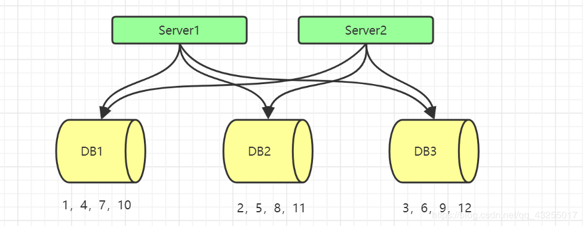
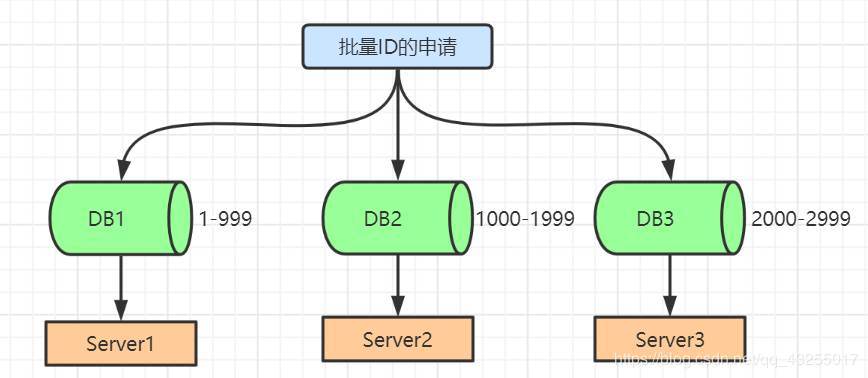
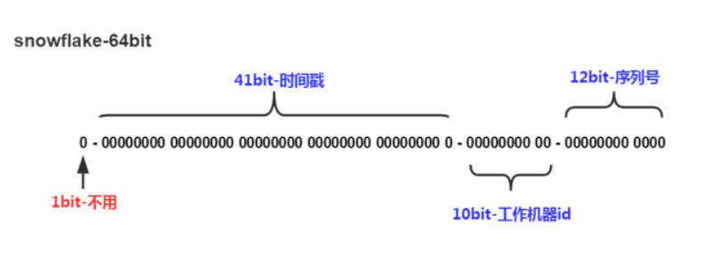

# 分布式：全局唯一ID实现方案

传统的单体架构的时候，我们基本是单库然后业务单表的结构。每个业务表的ID一般我们都是从1增，通过AUTO_INCREMENT=1设置自增起始值，但是在分布式服务架构模式下分库分表的设计，使得多个库或多个表存储相同的业务数据。这种情况根据数据库的自增ID就会产生相同ID的情况，不能保证主键的唯一性，所以期望有一个全局都能唯一的id来实现唯一性。

<!-- more -->

## 1.为什么要使用全局唯一id

传统的单体架构的时候，我们基本是单库然后业务单表的结构。每个业务表的ID一般我们都是从1增，通过AUTO_INCREMENT=1设置自增起始值，但是在分布式服务架构模式下分库分表的设计，使得多个库或多个表存储相同的业务数据。这种情况根据数据库的自增ID就会产生相同ID的情况，不能保证主键的唯一性，所以期望有一个全局都能唯一的id来实现唯一性。

接下就对在分布式环境下几种全局id的实现方式做一些分析

1. UUID生成。
2. 数据库生成。
3. Redis的方式。
4. 雪花算法-snowflake。
5. 百度UidGenerator算法
6. 美团Leaf算法
7. seqsvr


## 2.UUID生成

`UUID （Universally Unique Identifier）`，通用唯一识别码的缩写。UUID是由一组32位数的16进制数字所构成，所以UUID理论上的总数为 `16^32=2^128`，约等于 `3.4 x 10^38`。也就是说若每纳秒产生1兆个UUID，要花100亿年才会将所有UUID用完。

生成的UUID是由 8-4-4-4-12格式的数据组成，其中32个字符和4个连字符' - '，一般我们使用的时候会将连字符删除 uuid.`toString().replaceAll("-","")`。

目前UUID的产生方式有5种版本，每个版本的算法不同，应用范围也不同。

- `基于时间的UUID` - 版本1： 这个一般是通过当前时间，随机数，和本地Mac地址来计算出来，可以通过 org.apache.logging.log4j.core.util包中的 UuidUtil.getTimeBasedUuid()来使用或者其他包中工具。由于使用了MAC地址，因此能够确保唯一性，但是同时也暴露了MAC地址，私密性不够好。
- `DCE安全的UUID` - 版本2 DCE（Distributed Computing Environment）安全的UUID和基于时间的UUID算法相同，但会把时间戳的前4位置换为POSIX的UID或GID。这个版本的UUID在实际中较少用到。
- `基于名字的UUID（MD5）`- 版本3 基于名字的UUID通过计算名字和名字空间的MD5散列值得到。这个版本的UUID保证了：相同名字空间中不同名字生成的UUID的唯一性；不同名字空间中的UUID的唯一性；相同名字空间中相同名字的UUID重复生成是相同的。
- `随机UUID` - 版本4 根据随机数，或者伪随机数生成UUID。这种UUID产生重复的概率是可以计算出来的，但是重复的可能性可以忽略不计，因此该版本也是被经常使用的版本。JDK中使用的就是这个版本。
- `基于名字的UUID（SHA1）` - 版本5 和基于名字的UUID算法类似，只是散列值计算使用SHA1（Secure Hash Algorithm 1）算法。


虽然 UUID 生成方便，本地生成没有网络消耗，但是使用起来也有一些缺点，

- **不易于存储**：UUID太长，16字节128位，通常以36长度的字符串表示，很多场景不适用。
- **信息不安全**：基于MAC地址生成UUID的算法可能会造成MAC地址泄露，暴露使用者的位置。
- **对MySQL索引不利**：如果作为数据库主键，在InnoDB引擎下，UUID的无序性可能会引起数据位置频繁变动，严重影响性能 (可以查阅 Mysql 索引原理 B+树的知识)


## 3.使用数据库生成

### 3.1.设置自增初始值和步长

直接使用数据自增id的时候，在单库的环境下没有问题，但是多库情况就会出现重复，那么如果想让他不重复，设置下自增的起点和步长是不是就可以避免呢？

我们可以根据分库/表的情况，给每个库/表【不同的自增起始值】和【相同的步长】，如下图：




如上，数据库分三个库  在自增id一次可设置为 1,2,3  步长为分库数量 3。 

**这种方案有3个弊端**

- 在面对扩容的时候？是不是就很难搞了？

  面对扩容的时候也是可以处理，就是在设置初始值和步长的时候做一些预留。 例如： 预计将来可能扩容到32个库 那么就把步长设置为32。

- 数据库单点问题

  没有做主从的话，单点故障，获取不到id，需做主从同步，master挂掉，切换slave

- 频繁获取带来的性能问题

  每次生成一个id，高并发情况下，性能受影响，频繁请求数据库


### 3.2.批量申请分发

针对上述的数据方式生成id的一个优化的方案就是批量分发id，一次性给对应的数据库分配一批id，当快使用完或者使用完后，再次申请一批。

通过一个id分发中心，给业务数据库分发id，每次分发一批，用完再次申请，如下图：




## 4.Redis实现

使用数据生成的方式，在分布式高并发的环境下，性能可能就吃紧了，为了提供性能，就可以选择使用redis来生成唯一id

redis生成唯一id的原理依赖 incr和incrBy这样的自增指令，保证原子性，同时生成的id也是有序的。


但是使用redis生成的手需要考虑一个RDB和AOF异常情况下，对部分生成的id没有持久化，到时再次重启后分配的id是重复的问题。这里可以结合业务在做部分判断。


## 5.雪花算法-snowflake

Snowflake，雪花算法是由Twitter开源的分布式ID生成算法，以划分命名空间的方式将 64-bit位分割成多个部分，每个部分代表不同的含义。而 Java中64bit的整数是Long类型，所以在 Java 中 SnowFlake 算法生成的 ID 就是 long 来存储的。

- **第1位**占用1bit，其值始终是0，可看做是符号位不使用。
- **第2位**开始的41位是时间戳，41-bit位可表示2^41个数，每个数代表毫秒，那么雪花算法可用的时间年限是`(1L<<41)/(1000L360024*365)`=69 年的时间。
- **中间的10-bit位**可表示机器数，即2^10 = 1024台机器，但是一般情况下我们不会部署这么台机器。如果我们对IDC（互联网数据中心）有需求，还可以将 10-bit 分 5-bit 给 IDC，分5-bit给工作机器。这样就可以表示32个IDC，每个IDC下可以有32台机器，具体的划分可以根据自身需求定义。
- **最后12-bit位**是自增序列，可表示2^12 = 4096个数。

这样的划分之后相当于**在一毫秒一个数据中心的一台机器上可产生4096个有序的不重复的ID**。但是我们 IDC 和机器数肯定不止一个，所以毫秒内能生成的有序ID数是翻倍的。



java源码实现：

```java
/**
 * 
 *  SnowFlake的结构如下(每部分用-分开):<br>
 *  0 - 0000000000 0000000000 0000000000 0000000000 0 - 00000 - 00000 - 000000000000 <br>
 *  1位标识，由于long基本类型在Java中是带符号的，最高位是符号位，正数是0，负数是1，所以id一般是正数，最高位是0<br>
 *  41位时间截(毫秒级)，注意，41位时间截不是存储当前时间的时间截，而是存储时间截的差值（当前时间截 - 开始时间截)
 *  得到的值），这里的的开始时间截，一般是我们的id生成器开始使用的时间，由我们程序来指定的。41位的时间截，可以使用69年，年T = (1L << 41) / (1000L * 60 * 60 * 24 * 365) = 69<br>
 *  10位的数据机器位，可以部署在1024个节点，包括5位datacenterId和5位workerId<br>
 *  12位序列，毫秒内的计数，12位的计数顺序号支持每个节点每毫秒(同一机器，同一时间截)产生4096个ID序号<br>
 *  加起来刚好64位，为一个Long型。<br>
 *  SnowFlake的优点是，整体上按照时间自增排序，并且整个分布式系统内不会产生ID碰撞(由数据中心ID和机器ID作区分)，并且效率较高，经测试，SnowFlake每秒能够产生26万ID左右。
 */
public class SnowflakeId {
// ==============================Fields===========================================
    /**
     * 开始时间截 (2015-01-01)
     */
    private final long twepoch = 1420041600000L;

    /**
     * 机器id所占的位数
     */
    private final long workerIdBits = 5L;

    /**
     * 数据标识id所占的位数
     */
    private final long datacenterIdBits = 5L;

    /**
     * 支持的最大机器id，结果是31 (这个移位算法可以很快的计算出几位二进制数所能表示的最大十进制数)
     */
    private final long maxWorkerId = -1L ^ (-1L << workerIdBits);

    /**
     * 支持的最大数据标识id，结果是31
     */
    private final long maxDatacenterId = -1L ^ (-1L << datacenterIdBits);

    /**
     * 序列在id中占的位数
     */
    private final long sequenceBits = 12L;

    /**
     * 机器ID向左移12位
     */
    private final long workerIdShift = sequenceBits;

    /**
     * 数据标识id向左移17位(12+5)
     */
    private final long datacenterIdShift = sequenceBits + workerIdBits;

    /**
     * 时间截向左移22位(5+5+12)
     */
    private final long timestampLeftShift = sequenceBits + workerIdBits + datacenterIdBits;

    /**
     * 生成序列的掩码，这里为4095 (0b111111111111=0xfff=4095)
     */
    private final long sequenceMask = -1L ^ (-1L << sequenceBits);

    /**
     * 工作机器ID(0~31)
     */
    private long workerId;

    /**
     * 数据中心ID(0~31)
     */
    private long datacenterId;

    /**
     * 毫秒内序列(0~4095)
     */
    private long sequence = 0L;

    /**
     * 上次生成ID的时间截
     */
    private long lastTimestamp = -1L;

    //==============================Constructors=====================================

    /**
     * 构造函数
     *
     * @param workerId     工作ID (0~31)
     * @param datacenterId 数据中心ID (0~31)
     */
    public SnowflakeId(long workerId, long datacenterId) {
        if (workerId > maxWorkerId || workerId < 0) {
            throw new IllegalArgumentException(String.format("worker Id can't be greater than %d or less than 0", maxWorkerId));
        }
        if (datacenterId > maxDatacenterId || datacenterId < 0) {
            throw new IllegalArgumentException(String.format("datacenter Id can't be greater than %d or less than 0", maxDatacenterId));
        }
        this.workerId = workerId;
        this.datacenterId = datacenterId;
    }

    // ==============================Methods==========================================

    /**
     * 获得下一个ID (该方法是线程安全的)
     *
     * @return SnowflakeId
     */
    public synchronized long nextId() {
        long timestamp = timeGen();

        //如果当前时间小于上一次ID生成的时间戳，说明系统时钟回退过这个时候应当抛出异常
        if (timestamp < lastTimestamp) {
            throw new RuntimeException(
                    String.format("Clock moved backwards.  Refusing to generate id for %d milliseconds", lastTimestamp - timestamp));
        }

        //如果是同一时间生成的，则进行毫秒内序列
        if (lastTimestamp == timestamp) {
            sequence = (sequence + 1) & sequenceMask;
            //毫秒内序列溢出
            if (sequence == 0) {
                //阻塞到下一个毫秒,获得新的时间戳
                timestamp = tilNextMillis(lastTimestamp);
            }
        }
        //时间戳改变，毫秒内序列重置
        else {
            sequence = 0L;
        }

        //上次生成ID的时间截
        lastTimestamp = timestamp;

        //移位并通过或运算拼到一起组成64位的ID
        return ((timestamp - twepoch) << timestampLeftShift) //
                | (datacenterId << datacenterIdShift) //
                | (workerId << workerIdShift) //
                | sequence;
    }

    /**
     * 阻塞到下一个毫秒，直到获得新的时间戳
     *
     * @param lastTimestamp 上次生成ID的时间截
     * @return 当前时间戳
     */
    protected long tilNextMillis(long lastTimestamp) {
        long timestamp = timeGen();
        while (timestamp <= lastTimestamp) {
            timestamp = timeGen();
        }
        return timestamp;
    }

    /**
     * 返回以毫秒为单位的当前时间
     *
     * @return 当前时间(毫秒)
     */
    protected long timeGen() {
        return System.currentTimeMillis();
    }


    public static void main(String[] args) {

        SnowflakeId idWorker = new SnowflakeId(0, 0);
        for (int i = 0; i < 100; i++) {
            long id = idWorker.nextId();
            System.out.println(id);
        }
    }
}
```


## 6.百度UidGenerator算法

见 https://www.pdai.tech/md/arch/arch-z-id.html


## 7.美团Leaf算法

见 https://www.pdai.tech/md/arch/arch-z-id.html


##  8.seqsvr

https://www.infoq.cn/article/wechat-serial-number-generator-architecture


---

参考链接：

- https://www.pdai.tech/md/arch/arch-z-id.html
- https://juejin.cn/post/6847009773536149517