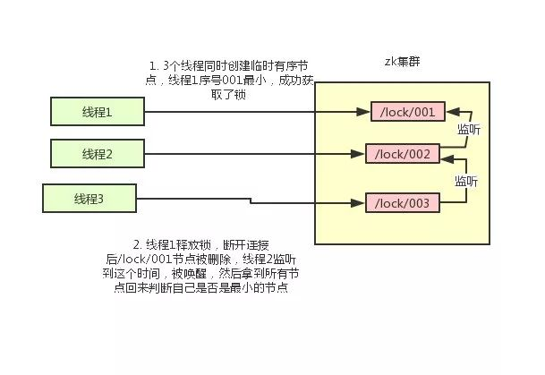

# 分布式：分布式锁及实现方案


## 1.为什么要使用分布式锁

1. 为了防止分布式系统中的多个进程之间相互干扰，需要一种分布式协调技术来对这些进程进行调度。而这个分布式协调技术的核心就是来实现这个分布式锁。

2. 为了保证一个方法或属性在高并发情况下的同一时间只能被同一个线程执行。

<!-- more -->

### 1.1背景

为了保证一个方法或属性在高并发情况下的同一时间只能被同一个线程执行。

在传统单体应用单机部署的情况下，可以使用Java并发处理相关的API(如ReentrantLock或Synchronized)进行互斥控制（加锁）。

在单机环境中，Java中提供了很多并发处理相关的API。但是，随着业务发展的需要，原单体单机部署的系统被演化成分布式集群系统后，

由于分布式系统多线程、多进程并且分布在不同机器上，这将使原单机部署情况下的并发控制锁策略失效，单纯的Java API并不能提供分布式锁的能力。

为了解决这个问题就需要一种跨JVM的互斥机制来控制共享资源的访问，这就是分布式锁出现的背景以及需要解决的问题！


### 1.2 分布式锁需要具备的条件

1. 在分布式系统环境下，一个方法在同一时间只能被一个机器的一个线程执行，

2. 高可用的获取锁与释放锁，

3. 高性能的获取锁与释放锁，

4. 具备可重入特性，并发使用，不会引起数据错误，并发操作时与单线程操作获得的结果是一样的，

5. 具备锁失效机制，能避免死锁，

6. 具备非阻塞锁特性，即没有获取到锁将直接返回获取锁失败。


对于分布式锁的实现，有一下几种常见方案

1. 技术数据库实现
2. 基于redis实现
3. 基于zookeeper实现


## 2.基于MySQL的分布式锁

技术mysql实现分布式锁的主要有两种方案，一种是数据库悲观锁，一种是乐观锁

### 2.1 基于悲观锁的实现

**原理**：

​	数据库设计上本身设计了锁相关操作，利用显示的数据库排他锁，即可实现简单的分布式锁功能

**实现**：

​	`select ... where ... for update` 显示加锁

**注意**：

​	where条件后的列需要加入索引，以便使用上行锁，不然就是全表扫描了，锁整张表，效率会很低

**特点:** 

​	使用数据库的锁机制，可以实现分布式锁的要求，但是源于数据加锁的负载性导致性能上不是很高，并发性不强。


### 2.2 基于乐观锁的实现

**原理:**

​	利用`UNIQUE KEY` 在使用的时候插入记录（获取锁），插入成功或者失败代表获取锁成功或者失败

**实现：**

​	创建一张LOCK表

```sql
CREATE TABLE `LOCK` ( 
`ID` int PRIMARY KEY NOT NULL AUTO_INCREMENT,  
`METHODNAME` varchar(64) NOT NULL DEFAULT '',
`DESCRIPTION` varchar(1024) NOT NULL DEFAULT '',  
`TIME` timestamp NOT NULL DEFAULT CURRENT_TIMESTAMP ON UPDATE CURRENT_TIMESTAMP,  
UNIQUE KEY `UNIQUEMETHODNAME` (`METHODNAME`) USING BTREE ) ENGINE=InnoDB DEFAULT CHARSET=utf8;
```


每次尝试获取锁的时候，通过插入数据 `insert into LOCK(METHODNAME,DESCRIPTION) values (‘getLock’,‘获取锁’) ;` 指定某个方法获取锁，插入成功即获取到锁，插入失败则表示获取锁失败

释放锁：`delete from LOCK where METHODNAME='getLock';` 

**特点：**

	1. 并发性能不高，因为基于数据库唯一索引
	2. 不可重入（同一个方法只能插入一条数据）
	3. 没有锁自动失效，可能死锁（例如释放锁的语句失败了）
	4. 没有公平性（每次都是抢占）

**延伸：**

​	针对这种方式的锁实现的几个问题，也有几种方案可以处理

​	不可重入：可以在表加上线程信息和重入次数，相同线程的重入次数+1 或者-1 ，类似jdk中多线程里面的 ReentrantLock的实现，存储了线程信息和state值

​	自动失效：加一个锁过期时间，在利用惰性删除，在获取锁失败（插入失败）的时候，获取数据信息，查询时间时候超时，超时删除（释放锁），下次获取锁就可以成功

​	公平性： 可以增加一个线程队列表，相当于排队，线程一直尝试获取，每次给时间早的先分配锁（插入lock表）

​	整体而言，有一些思路可以处理这些问题，但是通常不会用数据这种来做，思想确实可以借鉴的。


## 3.基于Redis的分布式锁

从数据库到redis的过滤，可以很好解决性能上的问题。

### 3.1 redis基本实现

**原理：**

​	主要利用redis的几个原子操作的命令：`setnx` 、`getset` 、`incr`

**实现：**

​	setnx: 存在则插入失败（获取锁失败），不存在则插入成功（获取锁成功），在配合lua脚本的删除，实现分布式锁。具体实现网上代码很多

​	getset:  返回值为空或者和设置的值一致则认为获取锁成功，否则获取失败，配合expire和del 使用，不过expire的添加没有原子性，优先选择setnx

​	incr:  incr结果为1代表获取成功，其他是代表失败，配合exipre和del使用，同getset一样的问题，优先选择setnx

**特点：**

​	利用setnx的原子性获取锁，同时配合lua的删除脚本释放锁。保证了【同一线程】、【高性能】、【自动失效】、【非阻塞】

**存在问题：**

1. 单机redis存在单点故障问题，使用主从话，主从切换的时候，又可能存在redis主从同步中极限情况下丢失的部分数据导致多个线程加锁成功的情况。
2. 不可重入问题
3. 锁自动过期时间问题，时间长了并发性不高，时间短了，锁就被别的线程抢占，冲突了。
4. 公平问题，目前都是抢占式非公平的

​	

综上，此种方式基本在单机情况下满足了大部分情况的要求。使用的时候需要主要他本身存在的问题带来的影响。


### 3.2 redisson的redlock

利用redisson中的锁相关实现来加锁，redisson中[`RLock`](http://static.javadoc.io/org.redisson/redisson/3.10.0/org/redisson/api/RLock.html) Java对象实现了`java.util.concurrent.locks.Lock`接口。同时还提供了[异步（Async）](http://static.javadoc.io/org.redisson/redisson/3.10.0/org/redisson/api/RLockAsync.html)、[反射式（Reactive）](http://static.javadoc.io/org.redisson/redisson/3.10.0/org/redisson/api/RLockReactive.html)和[RxJava2标准](http://static.javadoc.io/org.redisson/redisson/3.10.0/org/redisson/api/RLockRx.html)的接口，使用非常的方便。


关于redission 锁的实现，参考 [8. 分布式锁和同步器](https://github.com/redisson/redisson/wiki/8.-%E5%88%86%E5%B8%83%E5%BC%8F%E9%94%81%E5%92%8C%E5%90%8C%E6%AD%A5%E5%99%A8#84-%E7%BA%A2%E9%94%81redlock)


关于原理，作为一个待办项，以后有空看看源码，再整理一下


redisson redlock分布式锁疑问：

- https://github.com/redisson/redisson/issues/956
- https://github.com/redisson/redisson/issues/2044
- redlock 新版redisson（>=3.12.x）中提示直接用getLock代替，他会等待操作传递到从节点

xxxConnenctionManager.calcSlot 方法计算key的分布


## 4.基于Zookeeper的分布式锁

**原理：**

​	利用临时有序节点，并通过监听机制监听前一个节点的状态，通过事件通知顺序加锁。通过临时节点踢除释放锁

**实现：**

​	

**特点：**

​	基本上实现了锁的基本要求，分布式zk集群中也可以很好生效

​	【同一线程】、【高性能】、【高可用】、【自动失效】

**问题：**

1. 只能顺序加锁，不能抢占（用临时非有序节点，并通过注册监听可实现抢占式锁）
2. 默认不可重入（如需重入，需要在临时节点中加入线程信息和重入次数实现）
3. 失效问题（客户端由于网络抖动断开也可能会释放锁，需要选择合适的客户端重试策略，和sessiontiemout时间，避免误删除锁）


---

参考链接：

- [解读分布式锁及其实现方式](https://juejin.cn/post/6872001566111596552)
- [分布式锁（数据库、ZK、Redis）拍了拍你](https://juejin.cn/post/6850418111700680712)
- [分布式锁的实现之 redis 篇](https://xiaomi-info.github.io/2019/12/17/redis-distributed-lock/)

