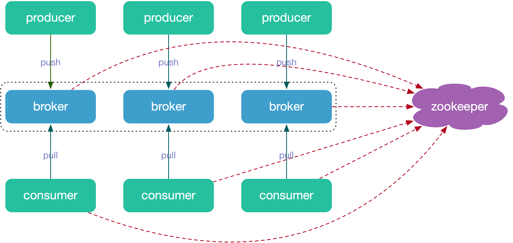
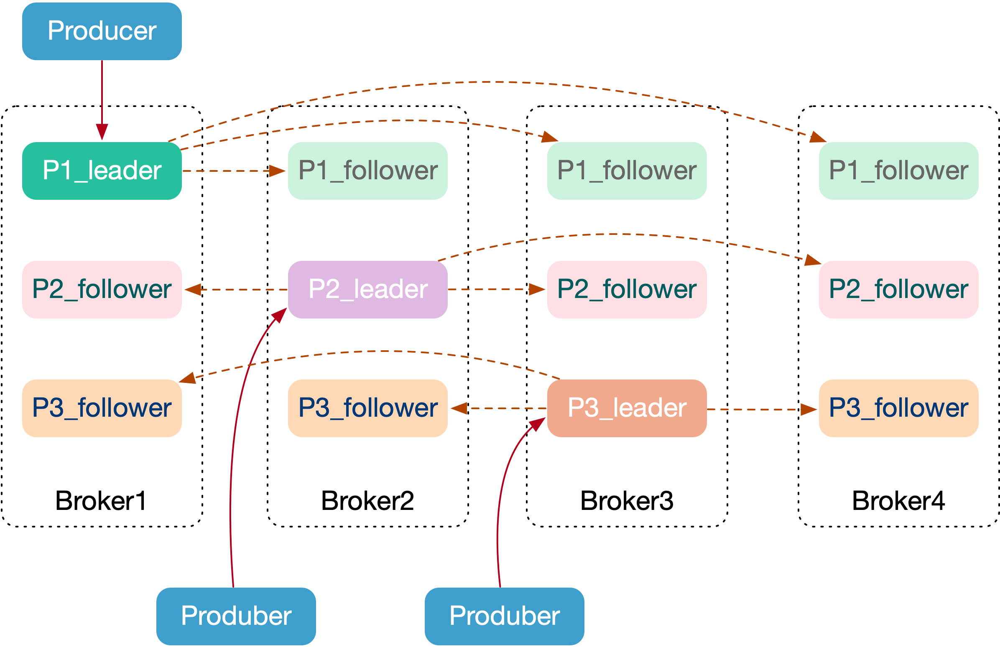

## 架构图

如上图所示，kafka架构组成为 一个kafka broker集群（多个broker组成），一个zookeeper集群，若干个 生成者和消费者直连broker进行生产和消费。

生产者向kafka集群push消息，消费者从kafka集群pull消息进行消息。broker集群和消费者向zookeeper注册，由zookeeper进行管理，zookeeper进行leader选举和consumer group 变化时进行relanlance

**概念**

- **Broker**

   消息中间件处理节点（服务器），一个节点就是一个broker，一个Kafka集群由一个或多个broker组成。消息内容存储在broker中

- **Producer**

   生产者，负责向kafka broker发送消息(push方式)

- **Consumer**
  
   消费者，负责从kafka broker拉去消息(pull方式), 多个消费者组成一个consumer group

- **Topic**

   消息的分类，同一类消息一个topic

- **Partition**

   同一个topic上面的消息，进行分区来存储，一个topic被有序分分成若干个分区，相当于topic的细分。

## Topic、Broker、Partition 的关系

在理解Tpoic、Broker、Partition之前，我们先看一下他们之前的关系图

如上图所有，一个topic创建4个分区的情况下，在每个broker有4个分区。zookeeper会在这些分区中选择一个分区作为主分区，即分区leader。Producer在生产消息时候，直连broker。broker从zookeeper获取当前哪些节点存活，主分区在哪个服务，producer就把消息发送给对应的主分区。主分区同步到各个follower分区。

从上图可以发现。由于partition leader会分布在不同分区（zookeeper根据节点情况，做负载均衡，选举leader），broker节点越多，kafka的吞吐也就越高。

## Consumer & Consumer Group 的关系

kafka官网给出一个关于kafka消费者和消费者group的关系，如下：

这个图可以清晰的说明Consumer 、Consumer Group 、Partition的关系。

1. 同一个分区的消息，可以被不同组的消费者消费。但同一个组内的消费，对于同一个分区，只能有一个消费者来消费。

2. 不同分区可以被同一个消费者消费

3. **同一个Consumer Group中**，消费者和分区的关系是 1对多。

## Kafka数据的存储

1. **kafka数据的存储**

kafka的消息是直接存放在硬盘上，并没有向其他的一些消息同写在内存，至于设计的原因，kafka官方文档有解析([kafka为何直接写硬盘-持久化](http://kafka.apachecn.org/documentation.html#design))。

kafka采用分区的概念，把topic分为多个分区，生产者push的数据，会被分配（使用轮询或者hash的方式）到不同的分区进行写入。kafka写数据是以追加的方式写入到Partition中。
>例如，如果使用用户ID作为key，则用户相关的所有数据都会被分发到同一个分区上。 这允许消费者在消费数据时做一些特定的本地化处理。这样的分区风格经常被设计用于一些本地处理比较敏感的消费者。

消息文件存在broker配置文件配置的消息目录中 `log.dirs=/tmp/kafka.log`

2. **zookeeper在kafka中管理哪些东西**

从kafka的结构图，我们可以发现和zookeeper产生关联的之后 broker和Consumer。所以，很明显zookeeper在kafka架构中主要管理broker和consumer的相关信息。

事实上，zookeeper的确实是做的这样的工作。

- broker信息

  broker启动后，向zookeeper进行注册。Broker在zookeeper中保存为一个临时节点，节点的路径是/brokers/ids/[brokerid],每个节点会保存对应broker的IP以及端口等信息.

- topic信息

  kafka的topic会分成不同分区。这些信息同样会存储在zookeeper上面。这也会为什么创建topic的时候需要传入zookeeper的地址原因。

- 生产负载均衡

  这些 broker信息和topic、Partition信息存储在zookeeper上之后，zookeeper就可以Topic上的watcher([zookeeper watches](https://zookeeper.apache.org/doc/r3.4.14/zookeeperProgrammers.html#ch_zkWatches))动态感知节点变化，根据节点的当前状态进行生产者负载(选择适合的节点作为 Partition Leader)。

- 消费者信息
  
  消费者监听topic的时候，会向zookeeper进行注册，消费的信息、消费者组的信息都会存储在zookeeper中。

- 消费负载均衡

  同样的，有消费者信息、消费者组的信息、broker信息 这些都在zookeeper中，zookeeper在消费者节点发生变化，broker发生变化的时候，进行负载。(zookeeper的监听机制，真的是个好东西)

- 消费OffSet

  kafka的消息是不断在Partition后面进行追加的，消费者通过一个offset定位每次消费的起点，拉取partition中从offset之后的所有信息。这个offset直接决定消费者可以看到的信息的范围，这个数据也被存储在zookeeper中。每个消费者消费时候根据zookeeper中的offset确认当前应该消费的数据。需要注意的是，将来的更新的kafka版本中，可能会弃用zookeeper存储offset的机制。以下是kafka关于此的说法

  > topic的consumer也在zookeeper中注册自己，以便相互协调和平衡数据的消耗。consumer也可以通过设置offsets.storage = zookeeper将他们的偏移量存储在zookeeper中。但是，这个偏移存储机制将在未来的版本中被弃用。因此，建议将数据迁移到kafka中。

## 消息的发送和消费

1. push 和 pull 机制的原理

关于push-based ，pull-based 即 基于推送，或者基于拉取。不管是push-based还是 pull-based都有其优点和缺点。kafka的设计的时候，producer 把数据 push 到 broker，然后 consumer 从 broker 中 pull 数据。

了解push-based pull-based，我们从几个问题出发，或许会更加清晰一些。

- 消息生产为什么选择使用push方式，而不使用pull呢 ？

  如果生产使用拉取方式，即 producer生产消息之后，存储在生产者本地，broker在从producer拉取。这种方式有明显的缺点就是，broker控制者消息的传输速率，加重了broker负担，broker要不断获取信息。即使在没有消息产生的时候，broker也需要不断的去拉取。并且其消息时效性会有缺失（生产者先缓存）。而生产环节，使用push可以让消息快速到达中间，不需要时效性缺失。

- 生产和消费为什么不全push？
  
  生产环节，使用push和消息推给中间件，消费时候为什么不也直接把消息推送给消费者？这样消息不是更加实时吗？确实，如果使用全 push-based 的方式，确实是这样，但是这样的设计会有一个明显的缺点，如果生产者消息生产的速率比较快。消费者会处理不过来，加重了消费者的负荷，相反，如果生产消息使用push, push过来的消息存储中间件（相当于做了一个缓冲）因此可以放心大胆的生产消息，消费根据自己的情况主动pull进行消费就会好很多。但是此做法，在部分情况下，会丧失实时性。

- 消费pull缺点
	
  消费环节使用pull的方式，利用中间件缓存数据，消费根据自己的负载来进行消费，上面提到的，1 可能导致时效性的丧失，2. Consumer可能会在一个紧密的循环中结束轮询，实际上 busy-waiting 直到数据到来。

2. 消息的发送

kafka在发送消息时候，Producer直连broker，从broker获取当前存活的broker节点，找到topic对用的partition leader，通过文件追加的方式，把数据写到对应topic的broker的 partition leader中。partition leader同步数据到各个follower。

此过程中，zookeeper 负责选举 partition leader来做到负载均衡，同时生产者生产消息的时候，利用partition(轮询或是通过key进hash的方式确定分区)设计，做到生产负载均衡。

同时，kafka也提供了在生产者本省做内存缓存消息之后在做批量发送的方式，来减少网络消耗。

3. 消息的消费

Consumer消费消息的时候，通过zookeeper获取到消费topic的partition的位置offset，然后一次拉取直连的broker中从offset开始的之后所有的数据进行消费

## 关于消息交付

- At most once——消息可能会丢失但绝不重传。
- At least once——消息可以重传但绝不丢失。
- Exactly once——这正是人们想要的, 每一条消息只被传递一次.

以下下为kafka的实现， 更加详细的，参考 [kafka中文社区-文档-设计思想-4.6 消息交付语义](http://kafka.apachecn.org/documentation.html#design)

>那么 exactly once 语义（即你真正想要的东西）呢？当从一个 kafka topic 中消费并输出到另一个 topic 时 (正如在一个Kafka Streams 应用中所做的那样)，我们可以使用我们上文提到的 0.11.0.0 版本中的新事务型 producer，并将 consumer 的位置存储为一个 topic 中的消息，所以我们可以在输出 topic 接收已经被处理的数据的时候，在同一个事务中向 Kafka 写入 offset。如果事务被中断，则消费者的位置将恢复到原来的值，而输出 topic 上产生的数据对其他消费者是否可见，取决于事务的“隔离级别”。 在默认的“read_uncommitted”隔离级别中，所有消息对 consumer 都是可见的，即使它们是中止的事务的一部分，但是在“read_committed”的隔离级别中，消费者只能访问已提交的事务中的消息（以及任何不属于事务的消息）。

参考资料：
- [kafka中文社区-文档-设计思想](http://kafka.apachecn.org/documentation.html#design)
- [Kafka架构图](https://zhuanlan.zhihu.com/p/38269875)
- [kafka与zookeeper间的关联](https://blog.csdn.net/nankiao/article/details/78553635)
- [Zookeeper在Kafka中的应用](https://blog.csdn.net/eric_sunah/article/details/46891901)

